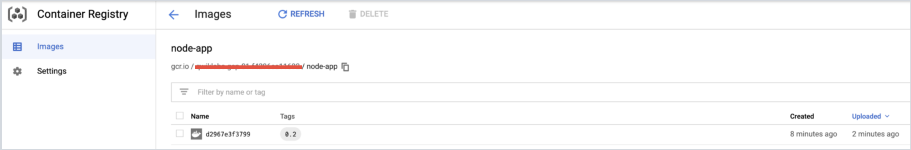
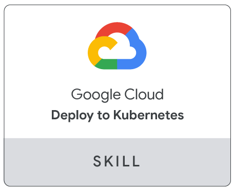

# Introduction to Docker

### Visão Geral

Docker é uma plataforma aberta para desenvolvimento, envio e execução de aplicativos. Com o Docker, você pode separar seus aplicativos de sua infraestrutura e tratá-la como um aplicativo gerenciado. O Docker ajuda a enviar código mais rápido, testar mais rápido, implantar mais rápido e reduzir o ciclo entre a escrita e a execução do código.


O Docker faz isso combinando recursos de contêiner de kernel com fluxos de trabalho e ferramentas que ajudam a gerenciar e implantar seus aplicativos.

Os contêineres do Docker podem ser usados diretamente no Kubernetes, o que permite que eles sejam executados no Kubernetes Engine com facilidade. Depois de aprender os fundamentos do Docker, você terá o conjunto de habilidades para começar a desenvolver Kubernetes e aplicativos em contêineres.

### O Que Você Aprenderá

Neste laboratório, você aprenderá a fazer o seguinte:

- Como construir, executar e depurar contêineres Docker.
- Como extrair imagens do Docker do Docker Hub e do Google Container Registry.
- Como enviar imagens do Docker para o Google Container Registry.

### Pré Requisitos

Este é um laboratório de nível introdutório. Presume-se que haja pouca ou nenhuma experiência anterior com Docker e contêineres. Familiaridade com o Cloud Shell e a linha de comando é sugerida, mas não obrigatória. Se você estiver procurando por materiais mais avançados nesta área de serviço, certifique-se de verificar os seguintes laboratórios:

- [App Dev: Deploying the Application into Kubernetes Engine - Python](https://google.qwiklabs.com/focuses/1073?parent=catalog)
- [Hello Node Kubernetes](https://google.qwiklabs.com/focuses/564?parent=catalog)
- [Managing Deployments Using Kubernetes Engine](https://google.qwiklabs.com/focuses/639?parent=catalog)

Quando estiver pronto, role para baixo para configurar seu ambiente de laboratório.

## Hello World


Abra o Cloud Shell e digite o seguinte comando para executar um contêiner hello world para começar:

```bash
docker run hello-world
```

Saída do Comando:

```bash
Unable to find image 'hello-world:latest' locally
latest: Pulling from library/hello-world
9db2ca6ccae0: Pull complete
Digest: sha256:4b8ff392a12ed9ea17784bd3c9a8b1fa3299cac44aca35a85c90c5e3c7afacdc
Status: Downloaded newer image for hello-world:latest

Hello from Docker!
This message shows that your installation appears to be working correctly.
...
```

Este contêiner simples retorna Hello from Docker! para sua tela. Embora o comando seja simples, observe na saída o número de etapas que ele executou. O docker daemon procurou a imagem hello-world, não encontrou a imagem localmente, puxou a imagem de um registro público chamado Docker Hub, criou um contêiner a partir dessa imagem e executou o contêiner para você.

Execute o seguinte comando para dar uma olhada na imagem do contêiner extraída do Docker Hub:

```bash
docker images
```

Saída do Comando:

```bash
REPOSITORY     TAG      IMAGE ID       CREATED       SIZE
hello-world    latest   1815c82652c0   6 days ago    1.84 kB
```

Esta é a imagem obtida do registro público do Docker Hub. O ID da imagem está no formato de hash SHA256 - este campo especifica a imagem Docker que foi provisionada. Quando o daemon do docker não consegue encontrar uma imagem localmente, ele irá, por padrão, procurar a imagem no registro público. Vamos executar o contêiner novamente:

```bash
docker run hello-world
```

Saída do Comando:

```bash
Hello from Docker!
This message shows that your installation appears to be working correctly.

To generate this message, Docker took the following steps:
...
```

Observe que na segunda vez em que você o executa, o daemon do docker encontra a imagem no registro local e executa o contêiner a partir dessa imagem. Não é necessário extrair a imagem do Docker Hub.

Por fim, observe os contêineres em execução executando o seguinte comando:

```bash
docker ps
```

Saída do Comando:

```bash
CONTAINER ID        IMAGE               COMMAND             CREATED             STATUS              PORTS               NAMES
```

Não há contêineres em execução. Os contêineres hello-world que você executou anteriormente já foram encerrados. Para ver todos os contêineres, incluindo aqueles que concluíram a execução, execute `docker ps -a`:

```bash
docker ps -a
```

Saída do Comando:

```bash
CONTAINER ID      IMAGE           COMMAND      ...     NAMES
6027ecba1c39      hello-world     "/hello"     ...     elated_knuth
358d709b8341      hello-world     "/hello"     ...     epic_lewin
```

Isso mostra o ID do contêiner, um UUID gerado pelo Docker para identificar o contêiner e mais metadados sobre a execução. Os nomes dos contêineres também são gerados aleatoriamente, mas podem ser especificados com docker run --name [nome do contêiner] hello-world.


## Build

Vamos construir uma imagem Docker baseada em um aplicativo em nodejs simples. Execute o seguinte comando para criar e alternar para uma pasta chamada test.

```bash
mkdir test && cd test
```

Criar um Dockerfile:

```Dockerfile
cat > Dockerfile <<EOF
# Use an official Node runtime as the parent image
FROM node:6

# Set the working directory in the container to /app
WORKDIR /app

# Copy the current directory contents into the container at /app
ADD . /app

# Make the container's port 80 available to the outside world
EXPOSE 80

# Run app.js using node when the container launches
CMD ["node", "app.js"]
EOF
```

Este arquivo instrui o daemon do Docker sobre como construir sua imagem.

- A linha inicial especifica a imagem pai de base, que neste caso é a imagem oficial do Docker para a versão 6 do nodejs.

- No segundo, definimos o diretório de trabalho (atual) do contêiner.

- No terceiro, adicionamos o conteúdo do diretório atual (indicado por ".") Ao contêiner.

- Em seguida, expomos a porta do contêiner para que ele possa aceitar conexões nessa porta e, por fim, executar o comando node para iniciar o aplicativo.

Passe algum tempo revisando as [referências de comando do Dockerfile](https://docs.docker.com/engine/reference/builder/#known-issues-run) para entender cada linha do `Dockerfile`.

Agora você escreverá o aplicativo de nó e, depois disso, construirá a imagem.

Execute o seguinte para criar o aplicativo de nó:

```bash
cat > app.js <<EOF
const http = require('http');

const hostname = '0.0.0.0';
const port = 80;

const server = http.createServer((req, res) => {
    res.statusCode = 200;
      res.setHeader('Content-Type', 'text/plain');
        res.end('Hello World\n');
});

server.listen(port, hostname, () => {
    console.log('Server running at http://%s:%s/', hostname, port);
});

process.on('SIGINT', function() {
    console.log('Caught interrupt signal and will exit');
    process.exit();
});
EOF
```
Este é um servidor HTTP simples que escuta na porta 80 e retorna "Hello World".


Agora vamos construir a imagem.


Observe novamente o ".", Que significa diretório atual, portanto, você precisa executar este comando de dentro do diretório que contém o Dockerfile:


```bash
docker build -t node-app:0.1 .
```

A execução deste comando pode demorar alguns minutos. Quando isso acontecer, sua saída deve ser semelhante a esta:

```bash
Sending build context to Docker daemon 3.072 kB
Step 1 : FROM node:6
6: Pulling from library/node
...
...
...
Step 5 : CMD node app.js
 ---> Running in b677acd1edd9
 ---> f166cd2a9f10
Removing intermediate container b677acd1edd9
Successfully built f166cd2a9f10
```

O `-t` serve para nomear e marcar uma imagem com a sintaxe `name:tag`. O nome da imagem é `node-app` e a `tag` é `0.1`. A tag é altamente recomendada ao construir imagens Docker. Se você não especificar uma tag, ela será padronizada como `latest` e se tornará mais difícil distinguir as imagens mais recentes das mais antigas. Observe também como cada linha no `Dockerfile` acima resulta em camadas de contêiner intermediárias conforme a imagem é construída.

Agora, execute o seguinte comando para ver as imagens que você construiu:

```bash
docker images
```

Sua saída deve ser semelhante a esta:

```bash
REPOSITORY     TAG      IMAGE ID        CREATED            SIZE
node-app       0.1      f166cd2a9f10    25 seconds ago     656.2 MB
node           6        5a767079e3df    15 hours ago       656.2 MB
hello-world    latest   1815c82652c0    6 days ago         1.84 kB
```

Observe que o `node` é a imagem base e `node-app` é a imagem que você construiu. Você não pode remover o `node` sem remover o `node-app` primeiro. O tamanho da imagem é relativamente pequeno em comparação com as VMs. Outras versões da imagem do node, como `node:slim` e `node:alpine`, podem fornecer imagens ainda menores para facilitar o transporte. O tópico de redução do tamanho dos contêineres é explorado posteriormente em Tópicos avançados. Você pode ver todas as versões no repositório oficial [aqui](https://hub.docker.com/_/node).


## Run

Neste módulo, use este código para executar contêineres com base na imagem que você criou:

```bash
docker run -p 4000:80 --name my-app node-app:0.1
```

Saída do Comando:

```bash
Server running at http://0.0.0.0:80/
```

O sinalizador `--name` permite que você nomeie o contêiner, se desejar. O `-p` instrui o Docker a mapear a porta 4000 do host para a porta 80 do contêiner. Agora você pode acessar o servidor em `http://localhost:4000`. Sem o mapeamento da porta, você não seria capaz de alcançar o contêiner no localhost.

Abra outro terminal (no Cloud Shell, clique no ícone +) e teste o servidor:

```bash
curl http://localhost:4000
```

Saída do Comando:

```bash
Hello World
```

O contêiner será executado enquanto o terminal inicial estiver em execução. Se você deseja que o contêiner seja executado em segundo plano (não vinculado à sessão do terminal), é necessário especificar o sinalizador `-d`.

Feche o terminal inicial e execute o seguinte comando para parar e remover o contêiner:

```bash
docker stop my-app && docker rm my-app
```

Agora execute o seguinte comando para iniciar o contêiner em segundo plano:

```bash
docker run -p 4000:80 --name my-app -d node-app:0.1

docker ps
```

Saída do Comando:

```bash
CONTAINER ID   IMAGE          COMMAND        CREATED         ...  NAMES
xxxxxxxxxxxx   node-app:0.1   "node app.js"  16 seconds ago  ...  my-app
```

Observe que o contêiner está sendo executado na saída do docker ps. Você pode ver os logs executando `docker logs [container_id]`.

__Dica:__ Você não precisa escrever o ID do contêiner inteiro, desde que os caracteres iniciais identifiquem o contêiner de maneira exclusiva. Por exemplo, você pode executar docker logs 17b se o ID do contêiner for 17bcaca6f....

```bash
docker logs [container_id]
```


Saída do Comando:

```bash
Server running at http://0.0.0.0:80/
```

Vamos modificar o aplicativo. No Cloud Shell, abra o diretório de teste que você criou anteriormente no laboratório:

```bash
cd test
```

Edite `app.js` com um editor de texto de sua escolha (por exemplo, nano ou vim) e substitua "Hello World" por outra string:

```js
....
const server = http.createServer((req, res) => {
    res.statusCode = 200;
      res.setHeader('Content-Type', 'text/plain');
        res.end('Welcome to Cloud\n');
});
....
```

Crie esta nova imagem e marque-a com `0.2`:

```bash
docker build -t node-app:0.2 .
```

Saída do Comando:

```bash
Step 1/5 : FROM node:6
 ---> 67ed1f028e71
Step 2/5 : WORKDIR /app
 ---> Using cache
 ---> a39c2d73c807
Step 3/5 : ADD . /app
 ---> a7087887091f
Removing intermediate container 99bc0526ebb0
Step 4/5 : EXPOSE 80
 ---> Running in 7882a1e84596
 ---> 80f5220880d9
Removing intermediate container 7882a1e84596
Step 5/5 : CMD node app.js
 ---> Running in f2646b475210
 ---> 5c3edbac6421
Removing intermediate container f2646b475210
Successfully built 5c3edbac6421
Successfully tagged node-app:0.2
```

Observe na Etapa 2 que estamos usando uma camada de cache existente. Da Etapa 3 em diante, as camadas são modificadas porque fizemos uma alteração em `app.js`.

Execute outro contêiner com a nova versão da imagem. Observe como mapeamos a porta 8080 do host em vez de 80. Não podemos usar a porta 4000 do host porque ela já está em uso.

```bash
docker run -p 8080:80 --name my-app-2 -d node-app:0.2
docker ps
```

Saída do Comando:

```bash
CONTAINER ID     IMAGE             COMMAND            CREATED             
xxxxxxxxxxxx     node-app:0.2      "node app.js"      53 seconds ago      ...
xxxxxxxxxxxx     node-app:0.1      "node app.js"      About an hour ago   ...
```

Teste os contêiners

```bash
curl http://localhost:8080
```

Saída do Comando:

```bash
Welcome to Cloud
```

E agora teste o primeiro contêiner que você fez:

```bash
curl http://localhost:4000
```

Saída do Comando:

```bash
Hello World
```

## Debug

Agora que estamos familiarizados com a construção e execução de contêineres, vamos examinar algumas práticas de depuração.

Você pode ver os registros de um contêiner usando `docker logs [container_id]`. Se você quiser seguir a saída do log enquanto o contêiner está em execução, use a opção `-f`.

Saída do Comando:

```bash
Server running at http://0.0.0.0:80/
```

Às vezes, você desejará iniciar uma sessão Bash interativa dentro do contêiner em execução. Você pode usar o docker exec para fazer isso. Abra outro terminal (no Cloud Shell, clique no ícone +) e digite o seguinte comando:

```bash
docker exec -it [container_id] bash
```

Os sinalizadores `-it` permitem que você interaja com um contêiner alocando um pseudo-tty e mantendo o stdin aberto. Observe que o bash foi executado no diretório `WORKDIR` (/app) especificado no `Dockerfile`. A partir daqui, você tem uma sessão de shell interativa dentro do contêiner para depurar.

```bash
root@xxxxxxxxxxxx:/app#
```

Olhe para o diretório

```bash
ls
```

Saída do Comando:

```bash
Dockerfile  app.js
root@xxxxxxxxxxxx:/app#
```

Saia da sessão Bash. No novo terminal, digite:

```bash
exit
```

Você pode examinar os metadados de um contêiner no Docker usando Docker inspect:

```bash
docker inspect [container_id]
```

Saída do Comando:

```bash
[
    {
        "Id": "xxxxxxxxxxxx....",
        "Created": "2017-08-07T22:57:49.261726726Z",
        "Path": "node",
        "Args": [
            "app.js"
        ],
...
```

Use `--format` para inspecionar campos específicos do JSON retornado. Por exemplo:

```bash
docker inspect --format='{{range .NetworkSettings.Networks}}{{.IPAddress}}{{end}}' [container_id]
```

Exemplo de Saída:

```bash
192.168.9.3
```

Certifique-se de verificar os seguintes recursos para obter mais informações sobre depuração:

- Docker inspect [reference](https://docs.docker.com/engine/reference/commandline/inspect/#examples):
- Docker exec [reference](https://docs.docker.com/engine/reference/commandline/exec/):


## Publish

Agora você vai enviar sua imagem para o Google Container Registry (gcr). Depois disso, você removerá todos os contêineres e imagens para simular um ambiente novo e, em seguida, puxará e executará seus contêineres. Isso demonstrará a portabilidade dos contêineres Docker.

Para enviar imagens ao seu registro privado hospedado pelo gcr, você precisa marcar as imagens com um nome de registro. O formato é `[hostname]/[project-id]/[image]:[tag]`.

Para gcr:

- `[hostname]` = gcr.io
- `[project-id]` = ID do seu projeto
- `[imagem]` = nome da sua imagem
- `[tag]` = qualquer tag de string de sua escolha. Se não for especificado, o padrão é "mais recente".

Você pode encontrar o ID do seu projeto executando:

```bash
gcloud config list project
```

Saída do Comando:

```bash
[core]
project = [project-id]

Your active configuration is: [default]
```

Tag `node-app:0.2`. Substitua `[project-id]` pela sua configuração.

```bash
docker tag node-app:0.2 gcr.io/[project-id]/node-app:0.2
```

```bash
docker images
```

Saída do Comando:

```bash
REPOSITORY                      TAG         IMAGE ID          CREATED
node-app                        0.2         76b3beef845e      22 hours ago
gcr.io/[project-id]/node-app    0.2         76b3beef845e      22 hours ago
node-app                        0.1         f166cd2a9f10      26 hours ago
node                            6           5a767079e3df      7 days ago
hello-world                     latest      1815c82652c0      7 weeks ago
```

Envie esta imagem para gcr. Lembre-se de substituir `[id do projeto]`.

```bash
docker push gcr.io/[project-id]/node-app:0.2
```

Saída de comando (a sua pode ser diferente):

```bash
The push refers to a repository [gcr.io/[project-id]/node-app]
057029400a4a: Pushed
342f14cb7e2b: Pushed
903087566d45: Pushed
99dac0782a63: Pushed
e6695624484e: Pushed
da59b99bbd3b: Pushed
5616a6292c16: Pushed
f3ed6cb59ab0: Pushed
654f45ecb7e3: Pushed
2c40c66f7667: Pushed
0.2: digest: sha256:25b8ebd7820515609517ec38dbca9086e1abef3750c0d2aff7f341407c743c46 size: 2419
```

Verifique se a imagem existe no gcr visitando o registro de imagens em seu navegador. Você pode navegar pelo console em __Ferramentas > Container Registry__ ou visitar: `http://gcr.io/[project-id]/node-app`. Você deve chegar a uma página semelhante:



Vamos testar essa imagem. Você pode iniciar uma nova VM, ssh nessa VM e instalar o gcloud. Para simplificar, vamos apenas remover todos os contêineres e imagens para simular um ambiente novo.

Pare e remova todos os recipientes:

```bash
docker stop $(docker ps -q)
docker rm $(docker ps -aq)
```

Você deve remover as imagens filhas (do `node:6`) antes de remover a imagem do nó. Substitua `[project-id]`.

```bash
docker rmi node-app:0.2 gcr.io/[project-id]/node-app node-app:0.1
docker rmi node:6
docker rmi $(docker images -aq) # remove remaining images
docker images
```

Saída do Comando:

```bash
REPOSITORY          TAG                 IMAGE ID            CREATED             SIZE
```

Nesse ponto, você deve ter um ambiente pseudo-fresco. Puxe a imagem e execute-a. Lembre-se de substituir o `[project-id]`.

```bash
docker pull gcr.io/[project-id]/node-app:0.2
docker run -p 4000:80 -d gcr.io/[project-id]/node-app:0.2
curl http://localhost:4000
```

Saída do Comando:

```bash
Welcome to Cloud
```

## Test Completed Task

Clique em Verificar meu progresso para verificar sua tarefa executada. Se você publicou com sucesso a imagem do contêiner no Container Registry, verá uma pontuação de avaliação.

Aqui, mostramos a portabilidade de contêineres. Contanto que o Docker esteja instalado no host (no local ou VM), ele pode extrair imagens de registros públicos ou privados e executar contêineres com base nessa imagem. Não há dependências de aplicativo que precisam ser instaladas no host, exceto para Docker.

## Congratulations

Parabéns por completar a introdução ao Docker. Para recapitular, você:

- Executou contêineres com base em imagens públicas do Docker Hub.
- Crie suas próprias imagens de contêiner e envie-as ao Google Container Registry.
- Maneiras aprendidas de depurar contêineres em execução.
- Executou contêineres com base em imagens extraídas do Google Container Registry.


## Finish Your Quest

Este laboratório autoguiado faz parte do Qwiklabs [Kubernetes na Google Cloud](https://google.qwiklabs.com/quests/29) Quest. Uma Quest é uma série de laboratórios relacionados que formam um caminho de aprendizagem. Concluir esta Quest dá a você o emblema acima, como reconhecimento por sua conquista. Você pode tornar seu emblema público e vinculá-lo a seu currículo online ou conta de mídia social. Inscreva-se nesta Quest e receba crédito de conclusão imediatamente se você tiver feito este laboratório. [Veja outras Quests do Qwiklabs disponíveis](https://google.qwiklabs.com/catalog).


Procurando um laboratório prático de desafios para demonstrar suas habilidades ao BigQuery e validar seu conhecimento? Ao concluir esta missão, conclua este laboratório de desafio adicional para receber um selo digital exclusivo do Google Cloud.



### Take Your Next Lab


Continue sua Quest com [Hello Node Kubernetes](https://google.qwiklabs.com/focuses/564?parent=catalog) ou confira estas sugestões:

- [Orquestrando a nuvem com Kubernetes](https://google.qwiklabs.com/focuses/557?parent=catalog)
- [Managing Deployments Using Kubernetes and Kubernetes Engine](https://google.qwiklabs.com/focuses/639?parent=catalog)
