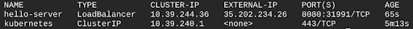
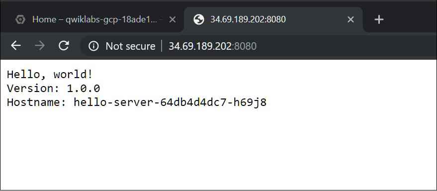

# Kubernetes Engine: Qwik Start

## Visão Geral

O Google Kubernetes Engine (GKE) oferece um ambiente gerenciado para implantação, gerenciamento e escalonamento de aplicativos em contêineres usando a infraestrutura do Google. O ambiente do Kubernetes Engine consiste em várias máquinas (especificamente, instâncias do Google Compute Engine) agrupadas para formar um cluster de contêiner. Neste laboratório, você criará contêineres e implantará aplicativos com o GKE.

### Orquestração de cluster com o Kubernetes Engine


Os clusters do Kubernetes Engine são fornecidos pelo sistema de gerenciamento de cluster de código aberto do Kubernetes. O Kubernetes oferece os mecanismos para você interagir com o cluster de contêiner. Você usa os comandos e recursos do Kubernetes para implantar e gerenciar os aplicativos, executar tarefas administrativas e definir políticas, além de monitorar a integridade das cargas de trabalho implantadas.


O Kubernetes se baseia nos mesmos princípios de design que guiam os serviços do Google mais conhecidos e oferece os mesmos benefícios: gerenciamento automático, sondagem de ativação e monitoramento para contêineres de aplicativos, escalonamento automático, atualizações contínuas e muito mais. Ao executar seus aplicativos em um cluster de contêiner, você está usando tecnologia baseada nos mais de 10 anos de experiência do Google em execução de cargas de trabalho de produção em contêineres.


### Kubernetes no Google Cloud Platform


Quando você executa um cluster do Kubernetes Engine, também tem acesso aos recursos avançados de gerenciamento de cluster que o Google Cloud Platform oferece. São eles:


- [Balanceamento de carga](https://cloud.google.com/compute/docs/load-balancing-and-autoscaling) para instâncias do Compute Engine
- [Pools de nós](https://cloud.google.com/kubernetes-engine/docs/concepts/node-pools) para designar subconjuntos de nós em um cluster, o que aumenta a flexibilidade
- [Escalonamento automático](https://cloud.google.com/kubernetes-engine/docs/concepts/cluster-autoscaler) da contagem de instâncias de nós do cluster
- [Atualizações automáticas](https://cloud.google.com/kubernetes-engine/docs/how-to/node-auto-upgrades) do software de nós do cluster
- [Reparação automática de nós](https://cloud.google.com/kubernetes-engine/docs/how-to/node-auto-repair) para manter a disponibilidade e a integridade dos nós
- [Geração de registros e monitoramento](https://cloud.google.com/stackdriver/docs/solutions/gke) com o Cloud Monitoring para ter uma visão do cluster


Agora que tem um conhecimento básico do Kubernetes, você aprenderá a implantar um aplicativo em contêiner com o Kubernetes Engine em menos de 30 minutos. Role a tela para baixo e siga as etapas para configurar o ambiente do seu laboratório.


## Como definir uma zona do Compute padrão


A [zona do Compute](https://cloud.google.com/compute/docs/regions-zones/#available) é um local regional próximo que armazena seus clusters e os recursos correspondentes. Por exemplo, `us-central1-a` é uma zona na região `us-central1`.

Inicie uma nova sessão no Cloud Shell e execute o seguinte comando para definir a zona do Compute padrão como `us-central1-a`:

```bash
gcloud config set compute/zone us-central1-a
```

Você receberá a seguinte resposta:

```bash
Updated property [compute/zone].
```

## Como criar um cluster do Kubernetes Engine


Um [cluster](https://cloud.google.com/kubernetes-engine/docs/concepts/cluster-architecture) consiste em pelo menos uma máquina mestre do cluster e diversas máquinas worker chamadas de nós. Os nós são [instâncias de máquina virtual (VM) do Compute Engine](https://cloud.google.com/compute/docs/instances/) que executam os processos do Kubernetes necessários para integrá-los ao cluster.


Para criar um cluster, execute o comando abaixo, substituindo `[CLUSTER-NAME]` pelo nome que você escolher (por exemplo, `my-cluster`). Os nomes de cluster precisam começar com uma letra, terminar com um caractere alfanumérico e não podem ter mais de 40 caracteres.

```bash
gcloud container clusters create [CLUSTER-NAME]
```

Ignore os avisos na resposta. A criação do cluster pode demorar alguns minutos. Assim que ele estiver pronto, você verá uma resposta parecida com esta:

```bash
NAME        LOCATION       ...   NODE_VERSION  NUM_NODES  STATUS
my-cluster  us-central1-a  ...   1.13.11-gke.9  3          RUNNING
```

## Receba as credenciais de autenticação para o cluster


Depois de criar o cluster, você precisará de credenciais de autenticação para interagir com ele.


Para autenticar o cluster, execute o comando abaixo, substituindo `[CLUSTER-NAME]` pelo nome do seu cluster:


```bash
Fetching cluster endpoint and auth data.
kubeconfig entry generated for my-cluster.
```

## Como implantar um aplicativo no cluster

Agora que criou um cluster, você pode implantar um [aplicativo em contêiner](https://cloud.google.com/kubernetes-engine/docs/concepts/kubernetes-engine-overview) nele. Neste laboratório, você executará um `hello-app` no seu cluster.


O Kubernetes Engine usa objetos do Kubernetes para criar e gerenciar os recursos do seu cluster. O Kubernetes fornece o objeto de [implantação](https://kubernetes.io/docs/concepts/workloads/controllers/deployment/) para implantar aplicativos sem estado como servidores da Web. Os objetos de [serviço](https://kubernetes.io/docs/concepts/services-networking/service/) definem as regras e o balanceamento de carga para acessar seu aplicativo pela Internet.


Execute o seguinte comando kubectl create no Cloud Shell para criar um novo `hello-server` de implantação com a imagem de contêiner do `hello-app`:

```bash
kubectl create deployment hello-server --image=gcr.io/google-samples/hello-app:1.0
```

Você verá a seguinte resposta:


```bash
deployment.apps/hello-server created
```

Esse comando do Kubernetes cria um objeto de implantação que representa `hello-server`. Nesse caso, `--image` especifica uma imagem de contêiner a ser implantada. Nesse caso, o comando extrai a imagem de exemplo de um bucket do [Google Container Registry](https://cloud.google.com/container-registry/docs), e `gcr.io/google-samples/hello-app:1.0` indica a versão específica da imagem a ser extraída. Se nenhuma versão for especificada, a mais recente será usada.

Agora execute o comando [kubectl expose](https://kubernetes.io/docs/reference/generated/kubectl/kubectl-commands#expose) abaixo para criar um serviço do Kubernetes que expõe o aplicativo ao tráfego externo:


```bash
kubectl expose deployment hello-server --type=LoadBalancer --port 8080
```

Nesse comando:

- `--port` especifica a porta que o contêiner expõe.
- `type="LoadBalancer"` cria um balanceador de carga do Compute Engine para o contêiner.

Você verá a seguinte resposta:

```bash
service/hello-server exposed
```

Inspecione o serviço hello-server executando [kubectl get](https://kubernetes.io/docs/reference/generated/kubectl/kubectl-commands#get):

```bash
kubectl get service
```

Você verá uma resposta parecida com esta:




__Observação:__ um endereço IP externo pode levar um minuto para ser gerado. Execute o comando acima novamente se a coluna EXTERNAL-IP estiver com um status "pendente".

Na saída desse comando, copie o endereço IP externo do serviço da coluna `EXTERNAL IP`.

Veja o aplicativo no navegador da Web usando o endereço IP externo com a porta exposta:


```bash
http://[EXTERNAL-IP]:8080
```

Sua página deve ser semelhante ao seguinte:





## Limpeza


Execute o seguinte comando para excluir o cluster:

```bash
gcloud container clusters delete [CLUSTER-NAME]
```

Quando solicitado, digite S para confirmar. A exclusão do cluster pode levar alguns minutos. Para mais informações sobre clusters excluídos do Google Kubernetes Engine, [consulte a documentação](https://cloud.google.com/kubernetes-engine/docs/how-to/deleting-a-cluster).


## Parabéns!


Você acabou de implantar um aplicativo em contêiner no Kubernetes Engine.

### Termine a Quest


Continue com as Quests [Baseline: Infrastructure](https://google.qwiklabs.com/quests/33), [Google Cloud Essentials](https://google.qwiklabs.com/quests/23), [Kubernetes in Google Cloud](https://google.qwiklabs.com/quests/29) e [VM Migration](https://google.qwiklabs.com/quests/87). Uma Quest é uma série de laboratórios relacionados que formam um programa de aprendizado. Concluir esta Quest dá a você o selo acima como reconhecimento pela sua conquista. Você pode publicar os selos e incluir um link para eles no seu currículo on-line ou nas redes sociais. Caso você já tenha feito este laboratório, inscreva-se em uma Quest para ganhar os créditos de conclusão imediatamente. [Veja outras Quests do Qwiklabs](http://google.qwiklabs.com/catalog).
