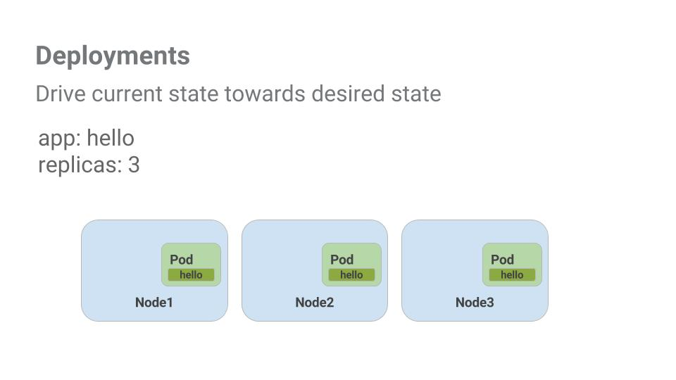

# Orquestração na nuvem com o Kubernetes

## Visão Geral

Neste laboratório, você aprenderá a:

- provisionar um cluster completo do [Kubernetes](https://kubernetes.io/) usando o[ Kubernetes Engine](https://cloud.google.com/kubernetes-engine);
- implantar e gerenciar contêineres do Docker usando kubectl;
- dividir um aplicativo em microsserviços usando as implantações e serviços do Kubernetes.

O Kubernetes gira em torno de aplicativos. Nesta parte do laboratório, você usará um aplicativo de exemplo chamado "app" para concluir as tarefas.


O [app](https://github.com/kelseyhightower/app) está hospedado no GitHub e oferece um aplicativo de exemplo de 12 fatores. Durante este laboratório, você trabalhará com as seguintes imagens do Docker:

- [kelseyhightower/monolith](https://hub.docker.com/r/kelseyhightower/monolith): o monolith inclui serviços auth e hello.
- [kelseyhightower/auth](https://hub.docker.com/r/kelseyhightower/auth): um microsserviço auth. Ele gera tokens JWT para usuários autenticados.
- [kelseyhightower/hello](https://hub.docker.com/r/kelseyhightower/hello): um microsserviço hello. Ele saúda os usuários autenticados.
- [ngnix](https://hub.docker.com/_/nginx): front-end para serviços auth e hello.


O Kubernetes é um projeto de código aberto (disponível em [kubernetes.io](https://kubernetes.io/)) que pode ser executado em diversos ambientes, de laptops a clusters com vários nós de alta disponibilidade, de nuvens públicas a implantações locais e de máquinas virtuais a bare metal.

Neste laboratório, será usado um ambiente gerenciado, como o Kubernetes Engine, para você se concentrar mais em testar o Kubernetes e não ter que configurar a infraestrutura subjacente.


### Google Kubernetes Engine

No ambiente do Cloud Shell, digite o seguinte comando para definir a zona:

```bash
gcloud config set compute/zone us-central1-b
```

Depois de definir a zona, inicie um cluster para usar neste laboratório:

```bash
gcloud container clusters create io
```

__Observação:__ a criação do cluster levará algum tempo, porque o Kubernetes Engine provisionará algumas máquinas virtuais em segundo plano para você usar.

## Receba o código de amostra


Clone o repositório do GitHub pela linha de comando do Cloud Shell:


```bash
git clone https://github.com/googlecodelabs/orchestrate-with-kubernetes.git

cd orchestrate-with-kubernetes/kubernetes
```

Liste os arquivos para ver com qual deles você está trabalhando:


```bash
ls
```

A amostra tem o seguinte layout:

```bash
deployments/  /* Deployment manifests */
  ...
nginx/        /* nginx config files */
  ...
pods/         /* Pod manifests */
  ...
services/     /* Services manifests */
  ...
tls/          /* TLS certificates */
  ...
cleanup.sh    /* Cleanup script */
```

Agora que você tem o código, é hora de começar a usar o Kubernetes.


## Demonstração rápida do Kubernetes

A maneira mais fácil de começar a usar o Kubernetes é com o comando `kubectl create`. Use-o para iniciar uma única instância do contêiner nginx:


```bash
kubectl create deployment nginx --image=nginx:1.10.0
```

O Kubernetes criará uma implantação. Há mais informações sobre implantações mais adiante. Por enquanto, tudo o que você precisa saber é que as implantações mantêm os pods funcionando mesmo quando há falha nos nós em que eles são executados.


No Kubernetes, todos os contêineres são executados em um pod. Use o comando `kubectl get pods` para ver o contêiner nginx em execução:

```bash
kubectl get pods
```

Quando o contêiner nginx está em execução, você pode expô-lo fora do Kubernetes usando o comando `kubectl expose`:

```bash
kubectl expose deployment nginx --port 80 --type LoadBalancer
```

O que acontecerá? O Kubernetes criará, em segundo plano, um balanceador de carga externo com um endereço IP público anexado a ele. Qualquer cliente que alcançar esse endereço IP público será encaminhado para os pods que estão por trás do serviço. Nesse caso, seria o pod do nginx.


Liste nossos serviços usando o comando de serviços `kubectl get`:

```bash
kubectl get services
```

__Observação__: o preenchimento do campo ExternalIP do seu serviço pode demorar alguns segundos. Isso é normal. Basta executar novamente o comando `kubectl get services` em intervalos de alguns segundos até o campo ser preenchido.

Adicione o IP externo a esse comando para acessar o contêiner Nginx remotamente:

```bash
curl http://<External IP>:80
```

Pronto! O Kubernetes é compatível com um fluxo de trabalho fácil e pronto para uso com os comandos `kubectl` run e expose.

Depois desse tour rápido pelo Kubernetes, é hora de você conhecer melhor cada um dos componentes e abstrações.

## Pods

No centro do Kubernetes está o [Pod](https://kubernetes.io/docs/concepts/workloads/pods/).

Os pods representam e retêm uma coleção de um ou mais contêineres. Geralmente, quando há vários contêineres com forte dependência uns dos outros, você os empacota dentro de um único pod.


Neste exemplo, há um pod que contém os contêineres monolith e nginx.


Os pods têm também [Volumes](https://kubernetes.io/docs/concepts/storage/volumes/). Volumes são discos de dados que duram o tempo que durarem os pods e podem ser usados pelos contêineres desses pods. Os pods fornecem um namespace compartilhado do conteúdo deles, ou seja, os dois contêineres dentro do nosso pod de exemplo podem se comunicar entre si e também compartilham os volumes anexados.

Os pods compartilham também um namespace de rede. Isso significa que há um endereço IP por pod.


Agora, vamos examinar melhor os pods.


## Crie Pods

Os pods podem ser criados usando arquivos de configuração de pod. Vamos explorar o arquivo de configuração de pod do monolith. Execute o comando a seguir:

```bash
cat pods/monolith.yaml
```

A saída mostra o arquivo de configuração aberto:


```yml
apiVersion: v1
kind: Pod
metadata:
  name: monolith
  labels:
    app: monolith
spec:
  containers:
    - name: monolith
      image: kelseyhightower/monolith:1.0.0
      args:
        - "-http=0.0.0.0:80"
        - "-health=0.0.0.0:81"
        - "-secret=secret"
      ports:
        - name: http
          containerPort: 80
        - name: health
          containerPort: 81
      resources:
        limits:
          cpu: 0.2
          memory: "10Mi"
```

Há algumas coisas para serem observadas aqui. Você verá que:

- seu pod é composto por um contêiner (monolith);
- alguns argumentos serão passados para nosso contêiner quando ele iniciar;
- a porta 80 será aberta para o tráfego http.

Crie o pod do monolith usando o comando `kubectl`:

```bash
kubectl create -f pods/monolith.yaml
```

Examine seus pods. Use o comando kubectl get pods para listar todos os pods em execução no namespace padrão:


```bash
kubectl get pods
```

__Observação__: pode levar alguns segundos para ativar o pod monolítico. A imagem do contêiner monolítico precisa ser extraída do Docker Hub para que ele possa ser executado.

Quando o pod estiver funcionando, use o comando `kubectl describe` para receber mais informações sobre o pod do monolith:

```bash
kubectl describe pods monolith
```

Você verá várias informações sobre o pod do monolith, incluindo o endereço IP do pod e o log de eventos. Essas informações serão úteis na solução de problemas.


O Kubernetes facilita a criação de pods, basta descrevê-los nos arquivos de configuração, além de simplificar a visualização das informações sobre eles quando estão em execução. Agora, você conseguirá criar todos os pods necessários para sua implantação.


### Interaja com os pods


Por padrão, os pods recebem um endereço IP privado e não podem ser alcançados fora do cluster. Use o comando `kubectl port-forward` para mapear uma porta local para uma porta dentro do pod do monolith.

> Neste ponto do laboratório, você vai trabalhar em várias guias do Cloud Shell para configurar a comunicação entre os pods. Qualquer comando executado em um segundo ou terceiro shell de comando será indicado nas instruções do comando.


Abra dois terminais do Cloud Shell. Um para executar o comando `kubectl port-forward` e o outro para emitir comandos `curl`.


No __2º terminal__, execute este comando para configurar o encaminhamento de portas:

```bash
kubectl port-forward monolith 10080:80
```

No __1º terminal__, comece a se comunicar com seu pod usando `curl`:

```bash
curl http://127.0.0.1:10080
```

Pronto! Você receberá um simpático "hello" do seu contêiner.


Agora, use o comando `curl` para ver o que acontece quando você alcança um ponto de extremidade seguro:

curl http://127.0.0.1:10080/secure

Ops.

Tente fazer login para receber um token de autenticação do monolith:

```bash
curl -u user http://127.0.0.1:10080/login
```

No prompt de login, use a senha supersecreta "password" para entrar.

A entrada fez com que o token JWT fosse impresso. Como o Cloud Shell não lida muito bem com a cópia de strings longas, crie uma variável de ambiente para o token.

```bash
TOKEN=$(curl http://127.0.0.1:10080/login -u user|jq -r '.token')
```

Digite novamente a senha supersecreta "password" quando for solicitado.

Use este comando para copiar e usar o token de acesso ao ponto de extremidade seguro com `curl`:

```bash
curl -H "Authorization: Bearer $TOKEN" http://127.0.0.1:10080/secure
```

Nesse momento, você receberá uma resposta do nosso aplicativo informando que está tudo certo novamente.

Use o comando `kubectl logs` para ver os registros do pod do monolith:

```bash
kubectl logs -f monolith
```

Abra um __3º terminal__ e use a sinalização `-f` para receber um stream dos registros adicionados em tempo real:

```bash
kubectl logs -f monolith
```

Agora, se você usar `curl` no __1º terminal__ para interagir com o monolítico, verá a atualização dos registros no __3º terminal__:

```bash
curl http://127.0.0.1:10080
```

Use o comando `kubectl exec` para executar um shell interativo dentro do pod do Monolith. Isso pode ser útil para solucionar problemas de dentro de um contêiner:

```bash
kubectl exec monolith --stdin --tty -c monolith /bin/sh
```

Por exemplo, quando há um shell em um contêiner monolith, podemos testar a conectividade externa usando o comando `ping`:

```bash
ping -c 3 google.com
```

Não esqueça de sair quando terminar esse shell interativo.

```bash
exit
```

Como você pode ver, a interação com os pods é tão fácil quanto usar o comando `kubectl`. Seja para acessar remotamente um contêiner ou para receber um shell de login, o Kubernetes fornece tudo o que você precisa para iniciar e seguir em frente.


## Serviços

Os pods não foram criados para serem persistentes. Eles podem ser interrompidos ou iniciados por muitas razões, por exemplo, falha nas verificações de integridade ou de prontidão, o que gera um problema:

O que acontece quando você quer se comunicar com um conjunto de pods? Quando eles forem reiniciados, poderão ter um endereço IP diferente.


É aqui que entram os [Serviços](https://kubernetes.io/docs/concepts/services-networking/service/). Eles fornecem pontos de extremidade estáveis para pods.


Os serviços aplicam rótulos para determinar os pods em que eles operam. Se os pods tiverem os rótulos corretos, serão automaticamente selecionados e expostos por nossos serviços.

O nível de acesso de um serviço a um conjunto de pods depende do tipo de serviço. Atualmente, existem três tipos:


- `ClusterIP` (interno) é o tipo padrão, significa que esse serviço só é visível dentro do cluster.
- `NodePort` concede a cada nó do cluster um IP externamente acessível.
- `LoadBalancer` adiciona um balanceador de carga do provedor de nuvem que encaminha o tráfego do serviço para os nós dentro dele.

Agora, você vai aprender a:

- criar um serviço;

- usar seletores de rótulo para expor um conjunto limitado de pods externamente.

## Crie um Serviço

Antes de criar nossos serviços, vamos primeiro criar um pod seguro que possa lidar com tráfego HTTPS.


Se você alterou diretórios, certifique-se de retornar ao diretório `~/orchestrate-with-kubernetes/kubernetes`:

```bash
cd ~/orchestrate-with-kubernetes/kubernetes
```

Explore o arquivo de configuração de serviço do monolith:


```bash
cat pods/secure-monolith.yaml
```

Crie os pods de secure-monolith e os dados de configuração deles:


```bash
kubectl create secret generic tls-certs --from-file tls/
kubectl create configmap nginx-proxy-conf --from-file nginx/proxy.conf
kubectl create -f pods/secure-monolith.yaml
```

Agora que você tem um pod seguro, é hora de expor o pod de secure-monolith externamente.Para fazer isso, crie um serviço do Kubernetes.

Explore o arquivo de configuração de serviço do monolith:


```bash
cat services/monolith.yaml
```

```yml
kind: Service
apiVersion: v1
metadata:
  name: "monolith"
spec:
  selector:
    app: "monolith"
    secure: "enabled"
  ports:
    - protocol: "TCP"
      port: 443
      targetPort: 443
      nodePort: 31000
  type: NodePort
```

Observações:


1. Há um seletor que é usado para localizar e expor automaticamente todos os pods com os rótulos "app=monolith" e "secure=enabled".

2. Agora, é preciso expor o nodeport aqui, para definir como vamos encaminhar o tráfego externo da porta 31000 para o nginx, na porta 443.

Use o comando `kubectl create` para criar o serviço do monolith a partir do arquivo de configuração de serviço do monolith:


```bash
kubectl create -f services/monolith.yaml
```

(Saída):

```bash
service "monolith" created
```

Você está usando uma porta para expor o serviço. Isso significa que poderá haver colisões de porta se outro app tentar se vincular à porta 31000 em um de seus servidores.

Normalmente, o Kubernetes lidaria com essa atribuição de porta. Neste laboratório, você escolheu uma porta para facilitar a configuração das verificações de integridade mais tarde.

Use o comando `gcloud compute firewall-rules` para permitir tráfego para o serviço do monolith no nodeport exposto:

```bash
gcloud compute firewall-rules create allow-monolith-nodeport \
  --allow=tcp:31000
```

Agora que está tudo configurado, você pode acessar o serviço secure-monolith de fora do cluster sem usar o encaminhamento de portas.


Escolha um endereço IP externo para um dos nós.

```bash
gcloud compute instances list
```

Agora, tente acessar o serviço secure-monolith usando `curl`:


```bash
curl -k https://<EXTERNAL_IP>:31000
```

Ops, o tempo limite esgotou. O que houve de errado?

É hora de fazer uma verificação rápida de conhecimento.Use os seguintes comandos para responder às perguntas abaixo:

`kubectl get services monolith`

`kubectl describe services monolith`

__Perguntas:__

- Por que você não recebeu uma resposta do serviço do monolith?
- O serviço do monolith tem quantos pontos de extremidade?
- Quais rótulos um pod precisa ter para ser selecionado pelo serviço do monolith?

Dica: isso está relacionado a rótulos. Você corrigirá o problema na próxima seção.


## Adicione rótulos a pods

Atualmente, o serviço do monolith não tem pontos de extremidade. Uma maneira de solucionar um problema como este é usar o comando `kubectl get pods` com uma consulta de rótulo.

Podemos ver que temos alguns pods em execução com o rótulo do monolith.

```bash
kubectl get pods -l "app=monolith"
```

Mas e o "app=monolith" e o "secure=enabled"?


```bash
kubectl get pods -l "app=monolith,secure=enabled"
```

Observe que essa consulta de rótulo não imprime nenhum resultado. Parece que precisamos adicionar o rótulo "secure=enabled" a eles.

Use o comando `kubectl label` para adicionar ao pod do secure-monolith o rótulo `secure=enabled` que falta. Depois, verifique se os rótulos foram atualizados.

```bash
kubectl label pods secure-monolith 'secure=enabled'
kubectl get pods secure-monolith --show-labels
```

Agora que seus pods estão rotulados corretamente, vamos ver a lista de pontos de extremidade no serviço do monolith:


```bash
kubectl describe services monolith | grep Endpoints
```

Agora você tem um!

Vamos testá-lo acessando um de nossos nós novamente.

```bash
gcloud compute instances list
curl -k https://<EXTERNAL_IP>:31000
```

Pimba! Está tudo certo.


## Implante aplicativos com o Kubernetes


O objetivo deste laboratório é prepará-lo para escalonar e gerenciar contêineres na produção. É aqui que entram as [Implantações](https://kubernetes.io/docs/concepts/workloads/controllers/deployment/#what-is-a-deployment). As implantações são uma maneira declarativa de garantir que o número de pods em execução seja igual ao número desejado de pods especificado pelo usuário.





O principal benefício das implantações é a abstração dos detalhes de nível inferior do gerenciamento de pods. As implantações usam controladores de replicação [ReplicaSet](https://kubernetes.io/docs/concepts/workloads/controllers/replicaset/) em segundo plano para gerenciar o início e a interrupção dos pods. Se for necessário atualizar ou o escalonar os pods, a implantação cuidará disso. A implantação também trata do reinício dos pods, caso eles parem por algum motivo.

Vamos ver um exemplo rápido:


Os pods estão vinculados ao ciclo de vida do nó no qual foram criados. No exemplo acima, o Node3 parou, e também um pod com ele. Em vez de criar manualmente um novo pod e encontrar um nó para ele, sua implantação criou um novo pod e o iniciou no Node2.


Isso é bem legal!


É hora de combinar tudo o que você aprendeu sobre pods e serviços para dividir o aplicativo do monolith em serviços menores usando as implantações.


## Crie implantações


Vamos dividir o app do monolith em três partes separadas:


- __auth__: gera tokens JWT para usuários autenticados.
- __hello__: saúda os usuários autenticados.
- __front-end__: encaminha o tráfego para os serviços auth e hello.

Estamos prontos para criar implantações, uma para cada serviço. Depois, definiremos serviços internos para as implantações de auth e hello e um serviço externo para a implantação de front-end. Depois de finalizado, você poderá interagir com os microsserviços, como o faz com o Monolith. Mas agora, cada parte poderá ser escalonada e implantada de maneira independente.

Comece examinando o arquivo de configuração de implantação de auth.


```bash
cat deployments/auth.yaml
```

Saída:

```yml
apiVersion: extensions/v1beta1
kind: Deployment
metadata:
  name: auth
spec:
  replicas: 1
  template:
    metadata:
      labels:
        app: auth
        track: stable
    spec:
      containers:
        - name: auth
          image: "kelseyhightower/auth:2.0.0"
          ports:
            - name: http
              containerPort: 80
            - name: health
              containerPort: 81
...
```

A implantação está criando uma réplica, e estamos usando a versão 2.0.0 do contêiner auth.


Quando você executa o comando `kubectl create` para criar a implantação de auth, ele cria um pod de acordo com os dados contidos no manifesto de Implantação. Isso significa que é possível escalonar o número de pods alterando o número especificado no campo Replicas.


De qualquer maneira, vá em frente e crie seu objeto de implantação:


```bash
kubectl create -f deployments/auth.yaml
```


É hora de criar um serviço para sua implantação de auth. Use o comando `kubectl create` para criar o serviço auth:


```bash
kubectl create -f deployments/auth.yaml
```

Repita o procedimento para criar e expor a implantação de hello:

```bash
kubectl create -f deployments/hello.yaml
kubectl create -f services/hello.yaml
```

E repita mais uma vez para criar e expor a implantação de frontend.

```bash
kubectl create configmap nginx-frontend-conf --from-file=nginx/frontend.conf
kubectl create -f deployments/frontend.yaml
kubectl create -f services/frontend.yaml
```

> Há mais uma etapa na criação do frontend, porque você precisa armazenar alguns dados de configuração com o contêiner.


Interaja com o frontend capturando seu IP externo e usando o comando curl:

```bash
kubectl get services frontend
curl -k https://<EXTERNAL-IP>
```

Você receberá uma saudação como resposta.


## Conclusão


Parabéns! Você desenvolveu um aplicativo de diversos serviços usando o Kubernetes. Use o conhecimento que você adquiriu aqui para implantar aplicativos complexos no Kubernetes usando uma coleção de implantações e serviços.


### Termine a Quest


Este laboratório autoguiado faz parte das Quests do Qwiklabs [Cloud Architecture](https://google.qwiklabs.com/quests/24) e [Kubernetes in the Google Cloud](https://google.qwiklabs.com/quests/29). Uma Quest é uma série de laboratórios relacionados que formam o programa de aprendizado. Concluir esta Quest dá a você o selo acima como reconhecimento da sua conquista. Você pode publicar os selos e incluir um link para eles no seu currículo on-line ou nas redes sociais. Caso você já tenha feito este laboratório, [inscreva-se em uma Quest](https://google.qwiklabs.com/quests/24) para ganhar os créditos de conclusão imediatamente. [Veja outras Quests do Qwiklabs disponíveis](http://google.qwiklabs.com/catalog).

#### Comece seu próximo laboratório

Faça o laboratório [Stackdriver: Qwik Start](https://google.qwiklabs.com/catalog_lab/906) para continuar a Quest ou confira estas sugestões:

- [Gerenciamento de desempenho de aplicativo (APM) com o Stackdriver](https://google.qwiklabs.com/catalog_lab/742)
