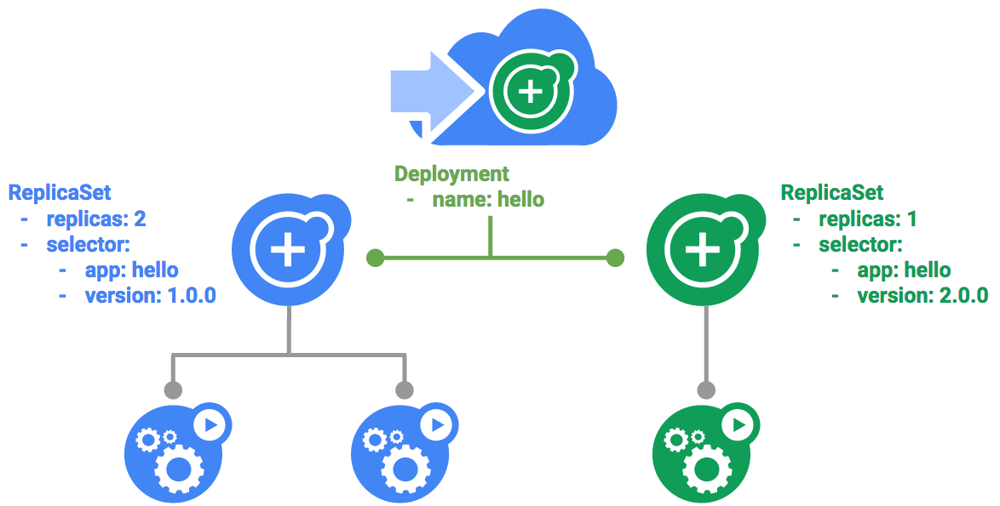

# Como Gerenciar Implantações Usando Kubernetes Engine

## Visão Geral

Regularmente, as práticas do Dev Ops usam várias implantações para gerenciar cenários de implantação de aplicativos, como a "Implantação contínua", as "Implantações azul-verde", as "Implantações canário", entre outras. Este laboratório oferece práticas de escalonamento e gerenciamento de contêineres para você criar esses cenários comuns, onde várias implantações heterogêneas são usadas.

### Atividades do Laboratório

- Praticar com a ferramenta kubectl
- Criar arquivos yaml de implantação
- Iniciar, atualizar e escalonar implantações
- Praticar a atualização de implantações e de estilos de implantação

### Pré-requisitos

- Laboratórios [Introdução ao Docker](https://google.qwiklabs.com/focuses/1029?parent=catalog) e [Hello Node Kubernetes](https://google.qwiklabs.com/focuses/564?parent=catalog) já concluídos
- Habilidades de administração do sistema Linux
- Teoria de Dev Ops: conceitos de implantação contínua


## Introdução às implantações

Em geral, as implantações heterogêneas envolvem a conexão de dois ou mais ambientes ou regiões de infraestrutura diferentes para atender a uma necessidade técnica ou operacional específica. As implantações heterogêneas são chamadas de "híbridas", "de várias nuvens" ou "públicas-particulares", dependendo das características específicas da implantação. As implantações heterogêneas usadas neste laboratório abrangem regiões dentro de um único ambiente de nuvem, de vários ambientes de nuvem pública (várias nuvens) ou uma combinação de ambientes de nuvem locais e públicos (híbridos ou públicos-particulares).


Vários desafios comerciais e técnicos podem surgir em implantações limitadas a um único ambiente ou região:

- __Recursos esgotados__: em qualquer ambiente único, particularmente em ambientes locais, talvez os recursos de computação, de rede e de armazenamento não atendam às suas necessidades de produção.

- __Alcance geográfico limitado__: as implantações em um único ambiente exigem que pessoas geograficamente distantes umas das outras acessem uma implantação. O tráfego delas pode viajar ao redor do mundo até um local central.


- __Disponibilidade limitada__: os padrões de tráfego na escala da Web desafiam os aplicativos a permanecerem resilientes e tolerantes a falhas.

- __Dependência de um fornecedor__: a plataforma e as abstrações da infraestrutura no nível do fornecedor podem impedir a portabilidade dos aplicativos.

- __Recursos inflexíveis__: seus recursos podem estar limitados a um determinado conjunto de ofertas de computação, armazenamento ou rede.

As implantações heterogêneas ajudam a superar esses desafios, mas precisam ser projetadas com processos e procedimentos programáticos e deterministas. Os procedimentos de implantação únicos ou ad-hoc podem tornar as implantações ou os processos frágeis e intolerantes a falhas. Os processos ad-hoc podem perder dados ou tráfego. Os bons processos de implantação precisam ser repetíveis e usar abordagens comprovadas para gerenciar o provisionamento, a configuração e a manutenção.


Três cenários comuns de implantação heterogênea são: implantações de várias nuvens, dados locais à frente e processos de integração contínua/entrega contínua (CI/CD, na sigla em inglês).

Os próximos exercícios colocam em prática alguns casos de uso comuns de implantações heterogêneas com abordagens bem-elaboradas usando o Kubernetes e outros recursos de infraestrutura.

### Defina a Zona

Execute o comando abaixo para definir sua zona de trabalho do GCP, substituindo a zona local por `us-central1-a`:

```bash
gcloud config set compute/zone us-central1-a
```

### Receba um código de amostra para este laboratório

Receba o código de amostra para criar e executar contêineres e implantações:

```bash
git clone https://github.com/googlecodelabs/orchestrate-with-kubernetes.git
cd orchestrate-with-kubernetes/kubernetes
```

Crie um cluster com cinco nós `n1-standard-1` (esse processo levará alguns minutos):


```bash
gcloud container clusters create bootcamp --num-nodes 5 --scopes "https://www.googleapis.com/auth/projecthosting,storage-rw"
```

### Saiba mais sobre o objeto de implantação


Daremos os primeiros passos com as implantações. Primeiro, conheceremos melhor o objeto de implantação. O comando `explain` no `kubectl` inclui informações sobre o objeto de implantação.

```bash
kubectl explain deployment
```

Também podemos ver que todos os campos estão usando a opção `--recursive`.

```bash
kubectl explain deployment --recursive
```

Você pode usar o comando "explain" durante o laboratório para entender a estrutura de um objeto de implantação e o que cada campo faz.

```bash
kubectl explain deployment.metadata.name
```

## Crie uma implantação

Atualize o arquivo cs `deployments/auth.yaml`:


```bash
vi deployments/auth.yaml
```

Inicie o editor:

```bash
i
```

Altere `image` na seção de contêineres da implantação para o seguinte:

```bash
...
containers:
- name: auth
  image: kelseyhightower/auth:1.0.0
...
```

Salve o arquivo `auth.yaml`: pressione `<Esc>` e depois:

```vim
:wq
```

Agora criaremos uma implantação simples. Examine o arquivo de configuração de implantação:

```bash
cat deployments/auth.yaml
```

Resposta:

```bash
apiVersion: extensions/v1beta1
kind: Deployment
metadata:
  name: auth
spec:
  replicas: 1
  template:
    metadata:
      labels:
        app: auth
        track: stable
    spec:
      containers:
        - name: auth
          image: "kelseyhightower/auth:1.0.0"
          ports:
            - name: http
              containerPort: 80
            - name: health
              containerPort: 81
...
```

Observe como a implantação está criando uma réplica e usando a versão 1.0.0 do contêiner "auth".

Quando você executa o comando `kubectl create` para criar a implantação de "auth", ele cria um pod de acordo com os dados do manifesto de implantação. Isso significa que podemos dimensionar o número de pods alterando o valor especificado no campo `replicas`.

Crie seu objeto de implantação usando `kubectl create`:

```bash
kubectl create -f deployments/auth.yaml
```

Depois de criar a implantação, confirme se ela foi gerada.

```bash
kubectl get deployments
```

Depois que a implantação for criada, o Kubernetes criará um ReplicaSet para ela. Podemos verificar se um ReplicaSet foi criado para nossa implantação usando:


```bash
kubectl get replicasets
```

Devemos ver um ReplicaSet com um nome semelhante a `auth-xxxxxxx`

Por fim, podemos ver os pods que foram criados como parte da nossa implantação. O Kubernetes cria o pod único quando o ReplicaSet é criado.

```bash
kubectl get pods
```

Agora vamos criar um serviço para nossa implantação de "auth". Como você já viu arquivos de manifesto de serviço, não entraremos em detalhes sobre isso aqui. Use o comando `kubectl create` para criar o serviço "auth".

```bash
kubectl create -f services/auth.yaml
```

Agora, faça o mesmo para criar e expor a implantação de "hello".

```bash
kubectl create -f deployments/hello.yaml
kubectl create -f services/hello.yaml
```

Repita o processo mais uma vez para criar e expor a implantação de "frontend".

```bash
kubectl create secret generic tls-certs --from-file tls/
kubectl create configmap nginx-frontend-conf --from-file=nginx/frontend.conf
kubectl create -f deployments/frontend.yaml
kubectl create -f services/frontend.yaml
```

> __Nota:__ você criou um ConfigMap para "frontend".


Interaja com "frontend" capturando seu IP externo e usando o comando "curl".

```bash
kubectl get services frontend
curl -ks https://<EXTERNAL-IP>
```

Você receberá a resposta de "hello".

Você também pode usar o recurso de modelagem de saída do kubectl para usar "curl" como uma opção:

```bash
curl -ks https://`kubectl get svc frontend -o=jsonpath="{.status.loadBalancer.ingress[0].ip}"`
```

### Dimensione uma implantação


Agora que já criamos uma implantação, podemos escaloná-la. Faça isso atualizando o campo `spec.replicas`. Para ver uma explicação sobre esse campo, use o comando `kubectl explain` novamente.

```bash
kubectl explain deployment.spec.replicas
```

O campo "replicas" pode ser facilmente atualizado com o comando `kubectl scale`:

```bash
kubectl scale deployment hello --replicas=5
```

> __Observação:__ pode levar mais ou menos um minuto até que todos os novos pods sejam iniciados.

Depois que a implantação for atualizada, o Kubernetes ajustará automaticamente o ReplicaSet associado e iniciará novos pods até atingir um total de cinco.


Confirme que agora existem cinco pods `hello` em execução:

```bash
kubectl get pods | grep hello- | wc -l
```

Agora diminua o escalonamento do aplicativo:

```bash
kubectl scale deployment hello --replicas=3
```

Novamente, confirme que você tem o número correto de pods.

```bash
kubectl get pods | grep hello- | wc -l
```

Você aprendeu sobre implantações do Kubernetes e como gerenciar e escalonar um grupo de pods.

## Atualização gradual

As implantações permitem atualizar as imagens para uma nova versão usando um mecanismo de atualização gradual. Quando uma implantação é atualizada para uma nova versão, ela cria um novo ReplicaSet e aumenta lentamente o número de réplicas no novo ReplicaSet à medida que diminui as réplicas no antigo ReplicaSet.



### Acione uma atualização gradual

Para atualizar sua implantação, execute o seguinte comando:

```bash
kubectl edit deployment hello
```

Altere image na seção de contêineres da implantação para o seguinte:


```bash
...
containers:
- name: hello
  image: kelseyhightower/hello:2.0.0
...
```

Salve e saia.

Depois de salvar e sair do editor, a implantação atualizada será salva no seu cluster, e o Kubernetes iniciará uma atualização gradual.

Veja o novo ReplicaSet criado pelo Kubernetes:

```bash
kubectl get replicaset
```

Você também pode ver uma nova entrada no histórico de lançamentos:


```bash
kubectl rollout history deployment/hello
```

### Pause uma atualização gradual

Se você detectar problemas em um lançamento em execução, pause-o para interromper a atualização. Faça isso agora:

```bash
kubectl rollout pause deployment/hello
```

Verifique o estado atual do lançamento:


```bash
kubectl rollout status deployment/hello
```

Você também pode ver isso diretamente nos pods:

```bash
kubectl get pods -o jsonpath --template='{range .items[*]}{.metadata.name}{"\t"}{"\t"}{.spec.containers[0].image}{"\n"}{end}'
```

### Retome uma atualização gradual

O lançamento está pausado, o que significa que alguns pods estão na nova versão, e outros, na mais antiga. Para retomar o lançamento, use o comando `resume`.

```bash
kubectl rollout resume deployment/hello
```

Quando o lançamento estiver concluído, você verá o seguinte ao executar o comando `status`.

```bash
kubectl rollout status deployment/hello
```

Saída:

```bash
deployment "hello" successfully rolled out
```

### Reverta uma atualização

Suponha que um bug tenha sido detectado na sua nova versão. Como ela provavelmente apresentará problemas, todos os usuários conectados aos novos pods terão esses problemas.

Reverta para a versão anterior, investigue o problema e depois publique a versão corrigida.

Faça a reversão usando o comando `rollout`:

```bash
kubectl rollout undo deployment/hello
```

Verifique a reversão no histórico:

```bash
kubectl rollout history deployment/hello
```

Por fim, confirme que todos os pods foram revertidos para as versões anteriores:

```bash
kubectl get pods -o jsonpath --template='{range .items[*]}{.metadata.name}{"\t"}{"\t"}{.spec.containers[0].image}{"\n"}{end}'
```

Excelente! Você aprendeu sobre atualizações graduais para implantações do Kubernetes e a atualizar aplicativos sem tempo de inatividade.


## Implantações canário

Quando você quiser testar uma nova implantação em produção com um subgrupo de usuários, use uma implantação canário. As implantações canário permitem que você publique uma alteração para um pequeno subgrupo de usuários, reduzindo o risco associado a novas versões.

### Crie uma implantação canário

Uma implantação canário consiste em uma implantação separada que contém sua nova versão e um serviço destinado tanto à implantação normal e estável quanto à implantação canário.


Primeiro, crie uma implantação canário para a nova versão:

```bash
cat deployments/hello-canary.yaml
```

Saída:

```bash
apiVersion: extensions/v1beta1
kind: Deployment
metadata:
  name: hello-canary
spec:
  replicas: 1
  template:
    metadata:
      labels:
        app: hello
        track: canary
        # Use ver 1.0.0 so it matches version on service selector
        version: 1.0.0
    spec:
      containers:
        - name: hello
          image: kelseyhightower/hello:2.0.0
          ports:
            - name: http
              containerPort: 80
            - name: health
              containerPort: 81
...
```

Atualize a versão para 1.0.0 (se sua versão estiver apontando para qualquer outra)

Agora crie a implantação canário:

```bash
kubectl create -f deployments/hello-canary.yaml
```

Depois que a implantação canário for criada, você terá duas implantações, `hello` e `hello-canary`. Confirme isso com este comando kubectl:

```bash
kubectl get deployments
```

No serviço `hello`, o seletor usa `app:hello`, que fará a correspondência dos pods nas __duas__ implantações, a de produção e a canário. No entanto, como a implantação canário tem menos pods, ela ficará visível para menos usuários.

### Verifique a implantação canário

Você pode verificar a versão de `hello` que está sendo atendida pela solicitação:

```bash
curl -ks https://`kubectl get svc frontend -o=jsonpath="{.status.loadBalancer.ingress[0].ip}"`/version
```

Execute esse comando várias vezes. Você verá que algumas solicitações são exibidas por "hello 1.0.0", e um pequeno subconjunto (1/4 = 25%) é atribuído à versão 2.0.0.

### Implantações canário em produção - afinidade da sessão

Neste laboratório, cada solicitação enviada ao serviço Nginx teve a chance de ser atendida pela implantação canário. E se você quisesse garantir que um usuário não fosse atendido pela implantação canário? Por exemplo, se a IU de um aplicativo tiver sido alterada e você não quiser confundir o usuário. Em uma situação como essa, é preferível que o usuário permaneça em apenas uma das implantações.


Você pode fazer isso criando um serviço com afinidade da sessão. Dessa forma, o mesmo usuário será sempre atendido pela mesma versão. No exemplo abaixo, o serviço é o mesmo de antes, mas um novo campo `sessionAffinity` foi adicionado e definido como ClientIP. As solicitações de todos os clientes com um determinado endereço IP serão enviadas para a mesma versão do aplicativo `hello`.

```bash
kind: Service
apiVersion: v1
metadata:
  name: "hello"
spec:
  sessionAffinity: ClientIP
  selector:
    app: "hello"
  ports:
    - protocol: "TCP"
      port: 80
      targetPort: 80
```

Como é difícil configurar um ambiente para testar isso, você não precisa fazer isso aqui, mas pode ser conveniente usar `sessionAffinity` para implantações canário em produção.

## Implantações azul-verde

As atualizações graduais são vantajosas porque permitem que você implante um aplicativo lentamente com o mínimo de sobrecarga, de impacto no desempenho e de tempo de inatividade. Em algumas situações, o ideal é apontar os balanceadores de carga para essa nova versão somente depois que ela tiver sido totalmente implantada. Nesse caso, as implantações azul-verde são o melhor caminho.

O Kubernetes faz isso criando duas implantações separadas; uma para a antiga versão "azul" e outra para a nova versão "verde". Use sua implantação de hello para a versão "azul". As implantações serão acessadas por um serviço que atuará como roteador. Quando a nova versão "verde" estiver em execução, você passará a usar essa versão ao atualizar o serviço.


> A principal desvantagem das implantações azul-verde é que você precisará ter pelo menos o dobro dos recursos necessários em seu cluster para hospedar o aplicativo. Verifique se você tem recursos suficientes em seu cluster antes de implantar as duas versões do aplicativo de uma só vez.

### O Serviço


Use o serviço "hello", mas atualize-o para que ele tenha um seletor `app:hello`, `version: 1.0.0.` O seletor corresponderá à implantação "azul". Ele não corresponderá à implantação "verde", porque usará uma versão diferente.

Primeiro atualize o serviço:

```bash
kubectl apply -f services/hello-blue.yaml
```

### Como atualizar usando a implantação azul-verde


Para oferecer um estilo de implantação azul-verde, criaremos uma nova implantação "verde" para nossa nova versão. A implantação verde atualiza o rótulo da versão e o caminho da imagem.


```bash
apiVersion: extensions/v1beta1
kind: Deployment
metadata:
  name: hello-green
spec:
  replicas: 3
  template:
    metadata:
      labels:
        app: hello
        track: stable
        version: 2.0.0
    spec:
      containers:
        - name: hello
          image: kelseyhightower/hello:2.0.0
          ports:
            - name: http
              containerPort: 80
            - name: health
              containerPort: 81
          resources:
            limits:
              cpu: 0.2
              memory: 10Mi
          livenessProbe:
            httpGet:
              path: /healthz
              port: 81
              scheme: HTTP
            initialDelaySeconds: 5
            periodSeconds: 15
            timeoutSeconds: 5
          readinessProbe:
            httpGet:
              path: /readiness
              port: 81
              scheme: HTTP
            initialDelaySeconds: 5
            timeoutSeconds: 1
```

Crie a implantação verde:


```bash
kubectl create -f deployments/hello-green.yaml
```

Depois que você tiver uma implantação verde e ela tiver sido iniciada corretamente, confirme que a versão atual da 1.0.0 ainda está sendo usada:

```bash
curl -ks https://`kubectl get svc frontend -o=jsonpath="{.status.loadBalancer.ingress[0].ip}"`/version
```

Agora, atualize o serviço apontando-o para a nova versão:

```bash
kubectl apply -f services/hello-green.yaml
```

Com o serviço atualizado, a implantação "verde" será usada imediatamente. Agora você pode verificar que a nova versão está sempre sendo usada.

```bash
curl -ks https://`kubectl get svc frontend -o=jsonpath="{.status.loadBalancer.ingress[0].ip}"`/version
```

### Reversão azul-verde

Se necessário, você pode reverter para a versão antiga da mesma maneira. Enquanto a implantação "azul" ainda estiver em execução, basta atualizar o serviço de volta para a versão antiga.

```bash
kubectl apply -f services/hello-blue.yaml
```

A reversão ocorrerá após a atualização do serviço. Novamente, verifique se a versão correta está sendo usada agora:


```bash
curl -ks https://`kubectl get svc frontend -o=jsonpath="{.status.loadBalancer.ingress[0].ip}"`/version
```

Parabéns! Você aprendeu sobre implantações azul-verde e a implantar atualizações em aplicativos que precisam alternar as versões de uma só vez.

## Parabéns!

Isso conclui este laboratório prático de gerenciamento de implantações com o Kubernetes. Neste laboratório, você teve a oportunidade de trabalhar mais com a ferramenta de linha de comando kubectl e com vários estilos de configurações de implantação em arquivos YAML para iniciar, atualizar e escalonar suas implantações. Com o que viu aqui, você já pode aplicar essas habilidades ao seu próprio trabalho de DevOps.

### Termine a Quest

Este laboratório autoguiado faz parte das Quests do Qwiklabs [Kubernetes in the Google Cloud](https://google.qwiklabs.com/quests/29), [Kubernetes Solutions](https://google.qwiklabs.com/quests/45) e [Cloud Engineering](https://google.qwiklabs.com/quests/66). Uma Quest é uma série de laboratórios relacionados que formam um programa de aprendizado. Ao concluir esta Quest, você ganha o selo acima como reconhecimento pela sua conquista. Você pode publicar os selos e incluir um link para eles no seu currículo on-line ou nas redes sociais. Caso você já tenha feito este laboratório, inscreva-se em uma Quest para ganhar os créditos de conclusão imediatamente. [Veja outras Quests do Qwiklabs](https://google.qwiklabs.com/catalog).

### Comece o próximo laboratório

Faça o laboratório Crie um bot do Slack com o Node.js no Kubernetes para continuar a Quest ou confira estas sugestões:

- [Entrega contínua com o Jenkins no Kubernetes Engine](https://google.qwiklabs.com/focuses/1104?parent=catalog)
- [Como usar o Kubernetes Engine para implantar aplicativos com discos permanentes regionais](https://google.qwiklabs.com/focuses/1050?parent=catalog)

### Próximas etapas / Saiba mais

- Leia mais em [Padrões de implantação heterogênea com Kubernetes](https://cloud.google.com/solutions/heterogeneous-deployment-patterns-with-kubernetes).
- Leia mais em [Guias e soluções de DevOps](https://cloud.google.com/devops) na documentação do Google Cloud.
- Conheça a [comunidade do Kubernetes](https://kubernetes.io/community/).
