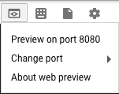
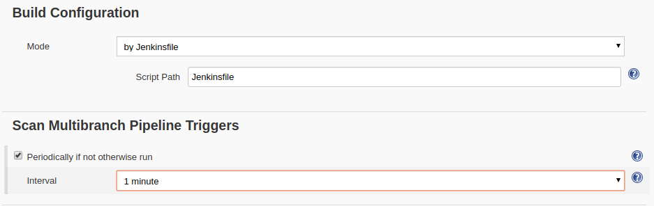

# Entrega contínua com o Jenkins no Kubernetes Engine

## Visão Geral

Neste laboratório, você aprenderá a configurar um canal de entrega contínua usando o Jenkins no Kubernetes Engine. O `Jenkins` é o servidor de automação usado por desenvolvedores que integram com frequência o próprio código em um repositório compartilhado. A solução que você criará neste laboratório será semelhante ao diagrama abaixo:


Veja [mais detalhes](https://cloud.google.com/solutions/jenkins-on-kubernetes-engine) sobre como usar o Jenkins no Kubernetes.


### Atividades deste laboratório


Neste laboratório, você realizará as seguintes tarefas:


- Provisionar um aplicativo do Jenkins em um cluster do Kubernetes Engine
- Configurar seu aplicativo do Jenkins usando o Gerenciador de pacotes Helm
- Conhecer os recursos de um aplicativo do Jenkins
- Criar e testar um canal do Jenkins

### Pré-requisitos

Este é um laboratório de __nível avançado__. Antes de começar, você precisa saber pelo menos os conceitos básicos de programação de shell, do Kubernetes e do Jenkins. Veja alguns Qwiklabs para você se preparar:

- Introdução ao Docker
- Hello Node Kubernetes
- Como gerenciar implantações com o Kubernetes Engine
- Como configurar o Jenkins no Kubernetes Engine


Quando estiver tudo pronto, role para baixo e saiba mais sobre o Kubernetes, o Jenkins e a entrega contínua.

### O que é o Kubernetes Engine?


O Kubernetes Engine é a versão hospedada do `Kubernetes` do GCP, um gerenciador de cluster e sistema de orquestração avançado para contêineres. O Kubernetes é um projeto de código aberto que pode ser usado em muitos ambientes diferentes, desde laptops a clusters de vários nós com alta disponibilidade e de máquinas virtuais a bare metal. Como mencionado acima, os apps do Kubernetes são desenvolvidos em `contêineres`. São aplicativos leves com todas as dependências e bibliotecas necessárias para executá-los. Essa estrutura subjacente torna os aplicativos Kubernetes altamente disponíveis, seguros e rápidos de implantar, o que é ideal para desenvolvedores de nuvem.

### O que é o Jenkins?

O [Jenkins](https://www.jenkins.io/) é um servidor de automação de código aberto que permite orquestrar com flexibilidade canais de versão, teste e implantação. Com o Jenkins, os desenvolvedores podem fazer iterações rápidas em projetos sem se preocupar com problemas de sobrecarga que podem ser gerados pela entrega contínua.


### O que é a entrega/implantação contínua?

Quando é preciso configurar um canal de entrega contínua (CD, na sigla em inglês), a implantação do Jenkins no Kubernetes Engine oferece benefícios importantes em comparação com uma implantação padrão baseada em VM.


Se você usar contêineres no processo de criação, um host virtual poderá executar jobs em vários sistemas operacionais. O Kubernetes Engine oferece `ephemeral build executors` (executores de compilação temporários), que são usados somente quando as versões estão ativamente em execução, deixando recursos para outras tarefas do cluster, como jobs de processamento em lote. Outra vantagem do uso de executores de compilação temporários é a velocidade, já que eles são iniciados em questão de segundos.


Além disso, o Kubernetes Engine vem com o balanceador de carga do Google, que pode ser usado para automatizar o roteamento de tráfego da Web para suas instâncias. O balanceador de carga processa a terminação SSL e usa um endereço IP global configurado com a rede de backbone do Google. Com a interface da Web, esse balanceador de carga sempre levará seus usuários a uma instância do aplicativo pelo caminho mais rápido possível.


Agora que você aprendeu um pouco sobre o Kubernetes, o Jenkins e como os dois interagem em um pipeline de CD, é hora de criar um.


## Clonar o repositório

Para fazer a configuração, abra uma nova sessão no Cloud Shell e execute o seguinte comando para definir sua zona `us-east1-d`:

```bash
gcloud config set compute/zone us-east1-d
```

Em seguida, clone o código de amostra do laboratório:


```bash
git clone https://github.com/GoogleCloudPlatform/continuous-deployment-on-kubernetes.git
```

Agora, mude para o diretório correto:

```bash
cd continuous-deployment-on-kubernetes
```

## Como provisionar o Jenkins

### Como criar um cluster do Kubernetes

Agora, execute o seguinte comando para provisionar um cluster do Kubernetes:


```bash
gcloud container clusters create jenkins-cd \
--num-nodes 2 \
--machine-type n1-standard-2 \
--scopes "https://www.googleapis.com/auth/source.read_write,cloud-platform"
```

Essa etapa pode demorar vários minutos para ser concluída. Os escopos extras permitem que o Jenkins acesse o Cloud Source Repositories e o Google Container Registry.

Antes de continuar, execute o seguinte comando para confirmar se o cluster está ativo:

```bash
gcloud container clusters list
```

Consulte as credenciais do cluster:


```bash
gcloud container clusters get-credentials jenkins-cd
```

O Kubernetes Engine usa essas credenciais para acessar seu cluster recém-provisionado. Confirme se você consegue se conectar a ele executando o seguinte comando:

```bash
kubectl cluster-info
```

## Instale o Helm

Neste laboratório, você usará o Helm para instalar o Jenkins do repositório Charts. O Helm é um gerenciador de pacotes que facilita a configuração e a implantação de aplicativos do Kubernetes. Depois de instalar o Jenkins, você poderá configurar seu canal de CI/CD.


1. Faça o download e a instalação do binário do Helm:

```bash
wget https://storage.googleapis.com/kubernetes-helm/helm-v2.14.1-linux-amd64.tar.gz
```

2. Descompacte o arquivo no Cloud Shell:


```bash
tar zxfv helm-v2.14.1-linux-amd64.tar.gz
cp linux-amd64/helm .
```

3. Adicione seu nome de usuário como administrador do cluster no RBAC para poder conceder permissões ao Jenkins:


```bash
kubectl create clusterrolebinding cluster-admin-binding --clusterrole=cluster-admin --user=$(gcloud config get-value account)
```

4. Conceda ao Tiller, o servidor do Helm, o papel de administrador do seu cluster:

```bash
kubectl create serviceaccount tiller --namespace kube-system
kubectl create clusterrolebinding tiller-admin-binding --clusterrole=cluster-admin --serviceaccount=kube-system:tiller
```

5. Inicialize o Helm. Isso garante que o servidor do Helm (Tiller) esteja instalado corretamente no seu cluster.

```bash
./helm init --service-account=tiller
./helm update
```

6. Execute o comando abaixo para verificar se o Helm está instalado corretamente. Você verá as versões do servidor e do cliente da v2.14.1:

```bash
./helm version
```

__Exemplo de resposta:__


```bash
Client: &version.Version{SemVer:"v2.14.1", GitCommit:"5270352a09c7e8b6e8c9593002a73535276507c0", GitTreeState:"clean"}
Server: &version.Version{SemVer:"v2.14.1", GitCommit:"5270352a09c7e8b6e8c9593002a73535276507c0", GitTreeState:"clean"}
```

## Configure e instale o Jenkins


Você usará um arquivo com valores personalizados para adicionar o plug-in específico ao GCP. Com esse recurso, você poderá usar as credenciais da conta de serviço e acessar o Cloud Source Repository.


1. Use a CLI do Helm para implantar o gráfico com suas configurações.


```bash
./helm install -n cd stable/jenkins -f jenkins/values.yaml --version 1.2.2 --wait
```

Talvez leve alguns minutos para que o comando seja concluído.

2. Após a execução do comando, verifique se o estado do pod do Jenkins está definido como "Running" e o do contêiner como "READY":


```bash
kubectl get pods
```

__Exemplo de resposta:__

```bash
NAME                          READY     STATUS    RESTARTS   AGE
cd-jenkins-7c786475dd-vbhg4   1/1       Running   0          1m
```

3. Configure a conta de serviço do Jenkins para poder fazer a implantação no cluster.


```bash
kubectl create clusterrolebinding jenkins-deploy --clusterrole=cluster-admin --serviceaccount=default:cd-jenkins
```

Você verá a seguinte resposta:

```bash
clusterrolebinding.rbac.authorization.k8s.io/jenkins-deploy created
```

4. Execute o seguinte comando para configurar o encaminhamento de portas da IU do Jenkins no Cloud Shell:

```bash
export POD_NAME=$(kubectl get pods --namespace default -l "app.kubernetes.io/component=jenkins-master" -l "app.kubernetes.io/instance=cd" -o jsonpath="{.items[0].metadata.name}")
kubectl port-forward $POD_NAME 8080:8080 >> /dev/null &
```

5. Agora, verifique se o serviço do Jenkins foi criado corretamente:


```bash
kubectl get svc
```

__Exemplo de resposta:__

```bash
NAME               CLUSTER-IP     EXTERNAL-IP   PORT(S)     AGE
cd-jenkins         10.35.249.67   <none>        8080/TCP    3h
cd-jenkins-agent   10.35.248.1    <none>        50000/TCP   3h
kubernetes         10.35.240.1    <none>        443/TCP     9h
```

Você está usando o [Plug-in do Kubernetes](https://wiki.jenkins-ci.org/display/JENKINS/Kubernetes+Plugin) para que os nós do builder sejam iniciados automaticamente, conforme necessário, quando o mestre do Jenkins os solicitar. Após a conclusão do processo, eles serão automaticamente desativados, e os recursos relacionados serão adicionados outra vez ao pool de recursos de clusters.

Esse serviço expõe as portas `8080` e `50000` dos pods que correspondem ao seletor. Isso vai expor as portas da IU da Web do Jenkins e as portas de registro do agente/construtor no cluster do Kubernetes. Além disso, os serviços jenkins-ui são expostos usando um ClusterIP para que não possam ser acessados de fora do cluster.


## Conecte-se ao Jenkins

1. O gráfico do Jenkins criará automaticamente uma senha de administrador para você. Para vê-la, execute:


```bash
printf $(kubectl get secret cd-jenkins -o jsonpath="{.data.jenkins-admin-password}" | base64 --decode);echo
```

2. Para acessar a interface do usuário do Jenkins, clique no botão "Web Preview" no Cloud Shell e em "Preview on port 8080":





3. Agora você poderá fazer login com o nome de usuário do administrador e sua senha gerada automaticamente.

A configuração do Jenkins no seu cluster do Kubernetes está pronta. O Jenkins gerenciará seus canais automatizados de CI/CD nas próximas seções.


## Entenda o aplicativo

Você implantará o aplicativo de amostra `gceme` no canal de implantação contínua. O aplicativo, escrito na linguagem Go, está no diretório sample-app do repositório. Quando você executa o binário gceme em uma instância do Compute Engine, o app exibe os metadados da instância em um card de informações.


O aplicativo simula um microsserviço aceitando dois modos de operação.


- No __modo de back-end__: o gceme detecta a atividade da porta 8080 e retorna metadados da instância do Compute Engine no formato JSON.

- No __modo de front-end__: o gceme consulta o serviço de back-end e renderiza o JSON resultante na interface do usuário.


## Como implantar o aplicativo


Você implantará o aplicativo em dois ambientes diferentes:

- __Produção__: é o site ativo que os usuários acessam.
- __Canário__: é um site de capacidade menor que só recebe uma porcentagem do tráfego do usuário. Use esse ambiente para validar seu software com o tráfego ativo antes de lançá-lo para todos os usuários.

No Google Cloud Shell, navegue para o diretório de aplicativos de amostra:


```bash
cd sample-app
```

Crie o namespace do Kubernetes para isolar logicamente a implantação:

```bash
kubectl create ns production
```

Use os comandos `kubectl apply` para criar as implantações das versões de produção e canário, além dos serviços:

```bash
kubectl apply -f k8s/production -n production

kubectl apply -f k8s/canary -n production

kubectl apply -f k8s/services -n production
```

Por padrão, somente uma réplica do front-end é implantada. Use o comando `kubectl scale` para garantir o mínimo de quatro réplicas em execução o tempo todo.

Escalone os front-ends do ambiente de produção executando o seguinte comando:


```bash
kubectl scale deployment gceme-frontend-production -n production --replicas 4
```

Agora, confirme que você tem cinco pods em execução para o front-end, quatro para o tráfego de produção e um para versões canário. As alterações na versão canário afetarão somente um a cada cinco usuários (20%):

```bash
kubectl get pods -n production -l app=gceme -l role=frontend
```

Além disso, confirme que você tem dois pods para o back-end, um para a produção e um para a versão canário:


```bash
kubectl get pods -n production -l app=gceme -l role=backend
```

Consulte o IP externo dos serviços de produção:

```bash
kubectl get service gceme-frontend -n production
```

__Observação:__ o endereço IP externo do balanceador de carga talvez leve alguns minutos para aparecer.


__Exemplo de resposta:__

```bash
NAME            TYPE          CLUSTER-IP     EXTERNAL-IP     PORT(S)  AGE
gceme-frontend  LoadBalancer  10.79.241.131  104.196.110.46  80/TCP   5h
```

Cole o __IP externo__ no navegador para ver o card de informações exibido. Você deverá ver uma página semelhante a esta:


Agora, armazene o IP do balanceador de carga do serviço de front-end em uma variável de ambiente para usar mais tarde:

```bash
export FRONTEND_SERVICE_IP=$(kubectl get -o jsonpath="{.status.loadBalancer.ingress[0].ip}" --namespace=production services gceme-frontend)
```


Para confirmar que os dois serviços estão funcionando, abra o endereço IP externo do front-end no navegador. Verifique a resposta da versão do serviço (que deve ser 1.0.0) executando o seguinte comando:


```bash
curl http://$FRONTEND_SERVICE_IP/version
```


Pronto. Você implantou o aplicativo de amostra. Agora, configure um canal para implantar as alterações de maneira contínua e confiável.


## Como criar um canal do Jenkins

### Como criar um repositório para hospedar o código-fonte do app de amostra

Crie uma cópia do app de amostra gceme e envie por push ao [Cloud Source Repository](https://cloud.google.com/source-repositories/docs/):

```bash
gcloud source repos create default
```

Ignore o aviso. Esse repositório não será cobrado.

```bash
git init
```

Inicialize o diretório sample-app como o próprio repositório Git:

```bash
git config credential.helper gcloud.sh
```

Execute este comando:

```bash
git remote add origin https://source.developers.google.com/p/$DEVSHELL_PROJECT_ID/r/default
```

Defina o nome de usuário e o endereço de e-mail para as confirmações do Git. Substitua `[EMAIL_ADDRESS]` pelo endereço de e-mail do Git e `[USERNAME]` pelo nome de usuário do Git:


```bash
git config --global user.email "[EMAIL_ADDRESS]"

git config --global user.name "[USERNAME]"
```

Adicione, confirme e envie os arquivos por push:


```bash
git add .

git commit -m "Initial commit"

git push origin master
```

### Como adicionar as credenciais da conta de serviço


Configure as credenciais para permitir que o Jenkins acesse o repositório do código. O Jenkins usará as credenciais da conta de serviço do seu cluster para fazer o download do código do Cloud Source Repositories.

__Etapa 1__: na interface do usuário do Jenkins, clique em __Credentials__ no painel de navegação à esquerda.

__Etapa 2__: clique em __Jenkins__


__Etapa 3__: clique em Global credentials (unrestricted).

__Etapa 4__: clique em Adicionar credenciais no painel de navegação à esquerda.

__Etapa 5__: selecione `Google Service Account from metadata` na lista suspensa Kind e clique em OK.


As credenciais globais foram adicionadas. O nome da credencial é `ID do projeto do GCP`, encontrado na seção `DETALHES DA CONEXÃO` do laboratório.


__Como criar o job do Jenkins__


Navegue até a interface do usuário do Jenkins e siga estas etapas para configurar um job de canal.


__Etapa 1__: clique em __Jenkins__ > __New Item__ no painel de navegação à esquerda:


__Etapa 2__: nomeie o projeto como __sample-app__, escolha a opção __Multibranch Pipeline__ e clique em OK.

__Etapa 3__: na próxima página, na seção __Branch Sources__, clique em __Add Source__ e selecione __git__.

__Etapa 4__: no campo __Project Repository__, cole o __URL do clone HTTPS__ do repositório sample-app no Cloud Source Repositories. Substitua `[PROJECT_ID]` pelo __ID do projeto do GCP__:

```bash
https://source.developers.google.com/p/[PROJECT_ID]/r/default
```

__Etapa 5__: na lista suspensa __Credentials__, selecione o nome das credenciais que você criou ao adicionar sua conta de serviço nas etapas anteriores.

__Etapa 6__: na seção __Scan Multibranch Pipeline Triggers__, marque a caixa __Periodically if not otherwise run__ e defina o valor de __Interval__ como 1 minuto.


__Etapa 7__: a configuração do seu job ficará assim:





__Etapa 8__: clique em __Save__ e mantenha as definições padrão das outras opções.

Depois que você concluir essas etapas, um job denominado "Branch indexing" será executado. Esse "meta-job" identifica os branches do repositório e garante que não ocorreram alterações neles. Se você clicar no sample-app no canto superior esquerdo, o job mestre será exibido.


__Observação__: a primeira execução do job mestre poderá falhar enquanto você não fizer algumas alterações no código na próxima etapa.

O canal do Jenkins está pronto. Em seguida, você criará o ambiente de desenvolvimento para integração contínua.


## Como criar o ambiente de desenvolvimento

Um branch de desenvolvimento é um conjunto de ambientes que os desenvolvedores usam para testar as alterações no código antes de enviá-las para integração ao site ativo. Esses ambientes são versões reduzidas do aplicativo, mas precisam ser implantados com os mesmos mecanismos do ambiente ativo.


### Crie um branch de desenvolvimento

Para criar um ambiente de desenvolvimento em um branch de recursos, você pode enviá-lo por push ao servidor Git e deixar o Jenkins implantar o ambiente.

Crie um branch de desenvolvimento e envie-o por push ao servidor Git:

```bash
git checkout -b new-feature
```

### Como modificar a definição do pipeline


O `Jenkinsfile` que define o pipeline é escrito com a [sintaxe do Groovy para pipelines do Jenkins](https://www.jenkins.io/doc/book/pipeline/syntax/) (página em inglês). Com um `Jenkinsfile`, é possível expressar todo um pipeline de versão em um único arquivo que coexiste com o código-fonte. Os canais são compatíveis com recursos eficientes, como o carregamento em paralelo, e exigem a aprovação manual do usuário.

Para que o canal funcione como esperado, é preciso modificar o `Jenkinsfile` para definir o código do seu projeto.


Abra o Jenkinsfile no seu editor de terminal, por exemplo, `vi`:

```bash
vi Jenkinsfile
```

Inicie o editor:

```bash
i
```

Adicione o `PROJECT_ID` ao valor `REPLACE_WITH_YOUR_PROJECT_ID`. (O `PROJECT_ID` é o ID do projeto do GCP encontrado na seção `DETALHES DA CONEXÃO` do laboratório. Você também pode executar o comando `gcloud config get-value project` para encontrá-lo:

```bash
def project = 'REPLACE_WITH_YOUR_PROJECT_ID'
def appName = 'gceme'
def feSvcName = "${appName}-frontend"
def imageTag = "gcr.io/${project}/${appName}:${env.BRANCH_NAME}.${env.BUILD_NUMBER}"
```

Salve o arquivo `Jenkinsfile` pressionando a tecla __Esc__, depois (para usuários do vi):

```bash
:wq
```

### Modifique o site

Para demonstrar como alterar o aplicativo, mude a cor dos cards do gceme de __azul__ para __laranja__.

Abra o `html.go`:

```bash
vim html.go
```

Inicie o Editor

```bash
i
```

Altere as duas instâncias de `<div class="card blue">` com o seguinte código:

```bash
<div class="card orange">
```


Salve o arquivo `html.go` pressionando a tecla __Esc__, depois:


```bash
:wq
```

Abra o `main.go`:

```bash
vi main.go
```

Inicie o Editor:

```bash
i
```

A versão é definida nesta linha:

```bash
const version string = "1.0.0"
```

Atualize-a para:

```bash
const version string = "2.0.0"
```

Salve o arquivo main.go novamente pressionando a tecla __Esc__, depois:


```bash
:wq
```

## Inicie a implantação

Confirme e envie suas alterações por push:


```bash
git add Jenkinsfile html.go main.go

git commit -m "Version 2.0.0"

git push origin new-feature
```

Isso iniciará a criação do seu ambiente de desenvolvimento.

Depois de enviar a alteração por push ao repositório Git, navegue até a interface do usuário do Jenkins. Você verá que a criação do branch new-feature foi iniciada. Pode levar até um minuto para que as alterações sejam detectadas.


Depois que a versão estiver em execução, clique na seta para baixo ao lado dela na navegação à esquerda e selecione __Console Output__:


Acompanhe a resposta da versão por alguns minutos e aguarde o início das mensagens kubectl `--namespace=new-feature apply...`. Agora, o branch new-feature será implantado no seu cluster.

__Observação__: em um cenário de desenvolvimento, você não usaria um balanceador de carga voltado para o público. Para proteger o aplicativo, você pode usar o proxy kubectl. O proxy faz a própria autenticação com a API Kubernetes e retransmite as solicitações da máquina local para o serviço no cluster sem expor seu serviço à Internet.

Se nada for exibido em `Build Executor`, não se preocupe. Acesse a página inicial do Jenkins --> app de amostra. Verifique se o pipeline `new-feature` foi criado.

Assim que tudo estiver pronto, inicie o proxy em segundo plano:

```bash
kubectl proxy &
```

Se o processo parar, pressione as teclas __ctrl + c__ para sair. Verifique se o aplicativo pode ser acessado enviando uma solicitação para `localhost` e permitindo que o proxy `kubectl` o encaminhe para seu serviço:

```bash
curl \
http://localhost:8001/api/v1/namespaces/new-feature/services/gceme-frontend:80/proxy/version
```

Você verá a resposta "2.0.0", que é a versão em uso no momento.

Se você receber um erro semelhante a este:

```bash
{
  "kind": "Status",
  "apiVersion": "v1",
  "metadata": {
  },
  "status": "Failure",
  "message": "no endpoints available for service \"gceme-frontend:80\"",
  "reason": "ServiceUnavailable",
  "code": 503
```

Isso significa que o endpoint do front-end ainda não foi propagado. Aguarde um pouco e tente o comando `curl` novamente. Prossiga quando receber a seguinte resposta:

```bash
2.0.0
```

Pronto. Você configurou o ambiente de desenvolvimento. Agora, você usará o que aprendeu no módulo anterior para implantar uma versão canário e testar um novo recurso.

## Como implantar uma versão canário

Você confirmou que seu app está executando o código mais recente no ambiente para desenvolvedores. Agora, implante esse código no ambiente canário.

Crie um branch canário e envie-o por push para o servidor Git:

```bash
git checkout -b canary

git push origin canary
```

No Jenkins, você verá que o pipeline canário foi iniciado. Depois de concluído, verifique o URL de serviço para garantir que parte do tráfego seja atendido pela nova versão. O esperado é que cerca de 1 em cada 5 solicitações (sem ordem específica) retorne a versão 2.0.0.


```bash
export FRONTEND_SERVICE_IP=$(kubectl get -o \
jsonpath="{.status.loadBalancer.ingress[0].ip}" --namespace=production services gceme-frontend)
```

```bash
while true; do curl http://$FRONTEND_SERVICE_IP/version; sleep 1; done
```

Se você continuar vendo a versão 1.0.0, tente executar os comandos acima novamente. Depois de garantir que está tudo certo, encerre o comando com __Ctrl-c__.

Pronto. Você implantou uma versão canário. Agora, implante a nova versão na produção.


## Como implantar a versão na produção

Agora que a versão canário está pronta e não houve reclamações de clientes, implante-a no restante da sua frota de produção.

Crie um branch canário e envie-o por push para o servidor Git:


```bash
git checkout master

git merge canary

git push origin master
```

No Jenkins, você verá que o pipeline mestre foi iniciado. Depois de concluído (o que pode levar alguns minutos), verifique o URL de serviço para garantir que parte do tráfego está sendo atendida pela nova versão, 2.0.0.

```bash
export FRONTEND_SERVICE_IP=$(kubectl get -o \
jsonpath="{.status.loadBalancer.ingress[0].ip}" --namespace=production services gceme-frontend)
```

```bash
while true; do curl http://$FRONTEND_SERVICE_IP/version; sleep 1; done
```


Mais uma vez, se você vir instâncias de 1.0.0, tente executar os comandos acima novamente. Se quiser parar esse comando, pressione __Ctrl-c__.

__Exemplo de resposta:__

```bash
gcpstaging9854_student@qwiklabs-gcp-df93aba9e6ea114a:~/continuous-deployment-on-kubernetes/sample-app$ while true; do curl http://$FRONTEND_SERVICE_IP/version; sleep 1; done
2.0.0
2.0.0
2.0.0
2.0.0
2.0.0
2.0.0
^C
```

Você também pode navegar para o site em que o aplicativo gceme exibe os cards de informações. A cor do card mudou de azul para laranja. Veja abaixo o comando que foi usado para consultar o endereço IP externo e confira a mudança:


```bash
kubectl get service gceme-frontend -n production
```

Exemplo de resposta:


## Teste seu conhecimento

Responda às perguntas de múltipla escolha a seguir para reforçar sua compreensão dos conceitos abordados neste laboratório. Use todo o conhecimento adquirido até aqui.


Which are the following Kubernetes namespaces used in the lab? (Quais são os seguintes namespaces do Kubernetes usados no laboratório?)

- [x] default
- [ ] helm
- [x] kube-system
- [ ] jenkins
- [x] production

The Helm chart is a collection of files that describe a related set of Kubernetes resources. (O gráfico Helm é uma coleção de arquivos que descreve um conjunto relacionado de recursos do Kubernetes.)

<input type="radio" checked/> Verdadeiro
<br />
<input type="radio"/> Falso

[Resposta](https://helm.sh/docs/topics/charts/)

__Pronto.__

Muito bem! Você implantou seu aplicativo na produção.

## Parabéns!


Isso conclui este laboratório prático sobre implantação e uso do Jenkins no Kubernetes Engine para ativar o canal de entrega/implantação contínua. Você teve a oportunidade de implantar uma ferramenta DevOps __importante__ no Kubernetes Engine e configurá-la para uso na produção. Você trabalhou com a ferramenta de linha de comando kubectl e as configurações de implantação em arquivos YAML, além de aprender um pouco sobre a configuração de canais do Jenkins para um processo de desenvolvimento/implantação. Com essa experiência prática, você deverá se sentir mais à vontade para usar essas ferramentas no seu próprio trabalho de DevOps.

### Termine a Quest

Este laboratório autoguiado faz parte das Quests do Qwiklabs [Kubernetes no Google Cloud](https://google.qwiklabs.com/quests/29), [Cloud Architecture](https://google.qwiklabs.com/quests/24) e [DevOps Essentials](https://google.qwiklabs.com/quests/96). Uma Quest é uma série de laboratórios relacionados que formam o programa de aprendizado. Concluir esta Quest dá a você o selo acima como reconhecimento pela sua conquista. Você pode publicar os selos e incluir um link para eles no seu currículo on-line ou nas redes sociais. Caso você já tenha feito este laboratório, inscreva-se em uma Quest para ganhar os créditos de conclusão imediatamente. [Veja outras Quests do Qwiklabs disponíveis](https://google.qwiklabs.com/catalog).


### Comece o próximo laboratório

Faça o laboratório [Hello Node Kubernetes](https://google.qwiklabs.com/focuses/564?parent=catalog) para continuar a Quest ou confira estas sugestões:

- [Orquestração na nuvem com o Kubernetes](https://google.qwiklabs.com/focuses/557?parent=catalog)

- [Como gerenciar implantações com o Kubernetes Engine](https://google.qwiklabs.com/focuses/639?parent=catalog)


