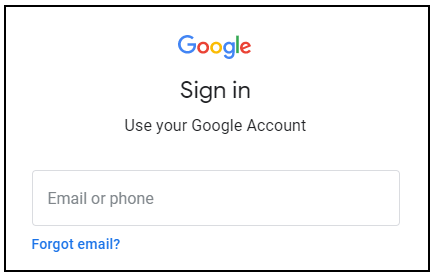

# Deploy to Kubernetes in Google Cloud

Kubernetes é o sistema de orquestração de contêineres mais popular, e o Google Kubernetes Engine foi projetado especificamente para oferecer suporte a implantações gerenciadas de Kubernetes no Google Cloud. Nesta missão de nível avançado, você terá prática na configuração de imagens Docker, contêineres e implantação de aplicativos Kubernetes Engine completos. Esta missão lhe ensinará as habilidades práticas necessárias para integrar a orquestração de contêineres em seu próprio fluxo de trabalho. Conclua esta missão, incluindo o laboratório de desafio no final, para receber um selo digital exclusivo do Google Cloud. O laboratório de desafio não fornece etapas prescritivas, mas exige que as soluções sejam desenvolvidas com o mínimo de orientação e colocará suas habilidades em tecnologia do Google Cloud à prova!

## Configuração e Requisitos


__Antes de clicar no botão Start Lab__

Leia estas instruções. Os laboratórios são cronometrados e você não pode pausá-los. O cronômetro, que começa quando você clica em Iniciar laboratório, mostra por quanto tempo os recursos do Google Cloud ficarão disponíveis para você.

Este laboratório prático do Qwiklabs permite que você mesmo faça as atividades do laboratório em um ambiente de nuvem real, não em um ambiente de simulação ou demonstração. Ele fornece novas credenciais temporárias que você usa para fazer login e acessar o Google Cloud durante o laboratório.

__O que você precisa__

Para concluir este laboratório, você precisa:

- Acesso a um navegador de Internet padrão (navegador Chrome recomendado).
- Tempo para concluir o laboratório.

> Observação: se você já tem sua conta ou projeto pessoal do Google Cloud, não o use para este laboratório.

> Observação: se você estiver usando um Pixelbook, abra uma janela anônima para executar este laboratório.

__Como iniciar seu laboratório e fazer login no Console do Google Cloud__

Clique no botão Iniciar laboratório. Se você precisar pagar pelo laboratório, um pop-up será aberto para você selecionar sua forma de pagamento. À esquerda está um painel preenchido com as credenciais temporárias que você deve usar para este laboratório.


Copie o nome de usuário e clique em Abrir console do Google. O laboratório aumenta os recursos e abre outra guia que mostra a página de login.



Dica: Abra as guias em janelas separadas, lado a lado.


Na página Sign in, cole o nome de usuário que você copiou do painel Connection Details. Em seguida, copie e cole a senha.

__Importante:__ você deve usar as credenciais do painel Detalhes da conexão. Não use suas credenciais do Qwiklabs. Se você tem sua própria conta do Google Cloud, não a use para este laboratório (evita cobranças adicionais).

Clique nas páginas subsequentes:

Aceite os termos e condições.

Não adicione opções de recuperação ou autenticação de dois fatores (porque esta é uma conta temporária).

Não se inscreva para avaliações gratuitas.

Após alguns momentos, o Cloud Console é aberto nesta guia.

__Observação:__ você pode visualizar o menu com uma lista de produtos e serviços do Google Cloud clicando no menu de navegação no canto superior esquerdo.


### Ative o Cloud Shell

O Cloud Shell é uma máquina virtual carregada com ferramentas de desenvolvimento. Ele oferece um diretório inicial persistente de 5 GB e é executado no Google Cloud. O Cloud Shell fornece acesso de linha de comando aos recursos do Google Cloud.

No Cloud Console, na barra de ferramentas superior direita, clique no botão Ativar Cloud Shell.


Clique em __Continue__


Leva alguns minutos para provisionar e se conectar ao ambiente. Quando você está conectado, você já está autenticado e o projeto está definido para o seu PROJECT_ID. Por exemplo:


gcloud é a ferramenta de linha de comando do Google Cloud. Ele vem pré-instalado no Cloud Shell e oferece suporte para preenchimento com guia.

Você pode listar o nome da conta ativa com este comando:

```bash
gcloud auth list
```

Saída:

```bash
Credentialed accounts:
 - <myaccount>@<mydomain>.com (active)
```

Exemplo de saída:

```bash
Credentialed accounts:
 - google1623327_student@qwiklabs.net
```

Você pode listar o ID do projeto com este comando:

```bash
gcloud config list project
```

Saída:

```bash
[core]
project = <project_ID>
```

Exemplo de saída:

```bash
[core]
project = qwiklabs-gcp-44776a13dea667a6
```

Para obter a documentação completa do gcloud, consulte a [visão geral da ferramenta de linha de comando gcloud](https://cloud.google.com/sdk/gcloud).

## Quest Outline

### Introdução ao Docker

Neste laboratório, você se familiarizará com os comandos básicos do ambiente de contêiner do Docker. Você criará, executará e depurará contêineres e aprenderá a extrair e enviar imagens de e para o Google Container Registry.

### Kubernetes Engine: Qwik Start

O Google Kubernetes Engine oferece um ambiente gerenciado para implantação, gerenciamento e escalonamento de aplicativos em contêineres usando a infraestrutura do Google. Veja neste laboratório prático como implantar um aplicativo em contêiner com o Kubernetes Engine. Assista ao vídeo curto [Manage Containerized Apps with Kubernetes Engine](https://www.youtube.com/watch?v=u9nsngvmMK4&feature=youtu.be).

### Orquestração na nuvem com o Kubernetes

Neste laboratório, você aprenderá a provisionar um cluster completo do Kubernetes usando o Google Container Engine, a implantar e gerenciar contêineres do Docker usando kubectl e a dividir um aplicativo em microsserviços usando as implantações e serviços do Kubernetes.

### Como gerenciar implantações usando o Kubernetes Engine

As práticas recomendadas de Dev Ops usam várias implantações para gerenciar cenários de implantação de aplicativos. Este laboratório oferece uma prática de escalonamento e gerenciamento de contêineres para criar cenários comuns, onde várias implantações heterogêneas são usadas.

### Entrega contínua com o Jenkins no Kubernetes Engine

Neste laboratório, você fará a implantação e toda a configuração de um canal de entrega contínua usando o Jenkins no Kubernetes Engine, além de conhecer o processo de desenvolvimento e implantação.


